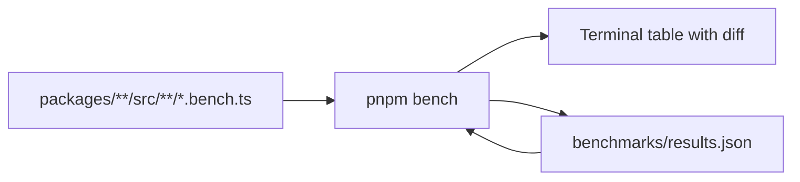
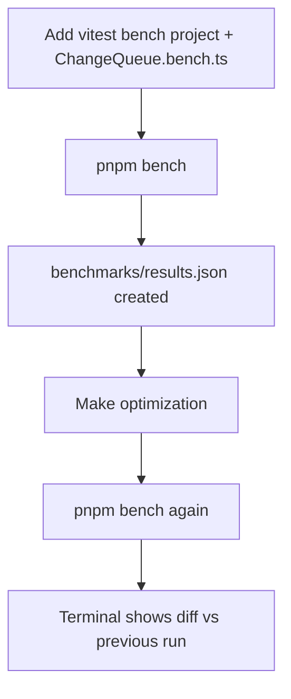

# ChangeQueue Benchmark Harness

## Goal

Benchmark the **current** [`ChangeQueue`](packages/core/src/core/ChangeQueue.ts) — no legacy copy. Use Vitest's built-in bench mode with zero wrapper scripts: one `pnpm bench` runs **all** `*.bench.ts` files in the repo. Each run diffs against the previous local run via Vitest's native `--compare` / `--outputJson` on a single shared [`benchmarks/results.json`](benchmarks/results.json).

Useful before and after the Map refactor in [changequeue_map_refactor_6d7731ef.plan.md](.cursor/plans/changequeue_map_refactor_6d7731ef.plan.md).

## Architecture



| Piece | Role |
|-------|------|
| `*.bench.ts` anywhere in `packages/` | Discovered automatically by Vitest bench mode |
| `benchmarks/results.json` | Read at start (`compare`), written at end (`outputJson`) — same file, no rotation |
| Vitest `BenchmarkReporter` | Terminal hz table; shows `[1.18x] ⇑` / `[0.98x] ⇓` vs previous when compare file exists |
| `pnpm bench` | Sole entry point — no orchestrator scripts |

**Dropped** (not necessary):
- `scripts/bench-changequeue.mjs` / per-benchmark scripts
- `scripts/bench-report.mjs` — Vitest terminal output + JSON is sufficient
- `benchmarks/changequeue/README.md` — brief note in CONTRIBUTING instead
- `results.previous.json`, `report.md` — rotation and markdown derived manually if ever needed

## 1. Vitest config: unit + bench projects

Update [`vitest.config.ts`](vitest.config.ts):

```typescript
projects: [
  {
    extends: true,
    test: {
      name: 'unit',
      include: ['packages/*/src/**/*.test.ts'],
      browser: { enabled: true, provider: playwright(), instances: [{ browser: 'chromium' }] },
    },
  },
  {
    extends: true,
    test: {
      name: 'bench',
      include: ['packages/*/src/**/*.bench.ts'],
      browser: { enabled: false },
      benchmark: {
        compare: './benchmarks/results.json',
        outputJson: './benchmarks/results.json',
      },
    },
  },
]
```

**Same-file compare trick**: Vitest reads `results.json` at init for baseline, runs benchmarks, then overwrites with new results. No file rotation script needed.

First run: compare file missing → Vitest logs a read error and runs without diff (acceptable). Second run onward: terminal shows per-benchmark `⇑` / `⇓` ratios.

Future benchmarks (e.g. Queue, EventDispatcher) add more `*.bench.ts` files — no config or script changes.

## 2. Package script

Add to [`package.json`](package.json):

```json
"bench": "vitest bench"
```

That's it. Optional filter: `pnpm bench packages/core` scopes to one package.

## 3. Output

```
benchmarks/
  results.json    # vitest --outputJson (generated each run, not gitignored, not auto-committed)
```

- Not in [`.gitignore`](.gitignore) — visible in `git status` after each run
- Optionally attach to optimization PRs for reviewer visibility
- No committed files under `benchmarks/` (directory may not exist until first run)

## 4. Bench scenarios (current impl only)

Add [`packages/core/src/core/ChangeQueue.bench.ts`](packages/core/src/core/ChangeQueue.bench.ts):

| Scenario | What it exercises |
|----------|-------------------|
| `queue N unique` | Lookup on insert |
| `coalesce K` | Hot path — same property updated repeatedly |
| `cancel` | Delete when value returns to `oldValue` |
| `dispatch M` | Full dispatch loop |
| `cascade` | Growing queue during dispatch |

Minimal `@Register` `BenchNode extends ReactiveNode`. Use `node._changeQueue`. Fresh state per `bench()` iteration.

## 5. Workflow



1. Land harness (no production code changes)
2. `pnpm bench` — establishes local baseline in `results.json`
3. Make optimization (e.g. Map refactor)
4. `pnpm bench` again — review terminal diff and optionally `git diff benchmarks/results.json`
5. Optionally attach `results.json` to PR

## 6. Future CI on pull requests (planned, not implemented now)

Commented stub in [`.github/workflows/ci.yml`](.github/workflows/ci.yml):

```yaml
bench:
  name: Benchmark
  runs-on: ubuntu-latest
  if: github.event_name == 'pull_request'
  steps:
    - uses: actions/checkout@v4
    - uses: pnpm/action-setup@v4
      with: { version: 9.5.0 }
    - uses: actions/setup-node@v4
      with: { node-version: '20.x', cache: pnpm }
    - run: pnpm install
    # Phase 2: restore cached benchmarks/results.json from main
    - run: pnpm bench
    - uses: actions/upload-artifact@v4
      if: always()
      with:
        name: benchmark-results
        path: benchmarks/results.json
```

**Phase 1**: informational artifact upload, no merge gate.

**Phase 2**: cache `results.json` from `main`; PR compares against it (same Vitest compare config).

## 7. Docs

Brief addition to [`.github/CONTRIBUTING.md`](.github/CONTRIBUTING.md) only:

- `pnpm bench` — run all benchmarks; outputs `benchmarks/results.json`
- First run: absolute numbers; subsequent runs: terminal diff vs previous
- Optionally attach `results.json` to performance PRs

## Files to create / modify

| File | Action |
|------|--------|
| [`vitest.config.ts`](vitest.config.ts) | Unit + bench projects, compare/outputJson paths |
| [`package.json`](package.json) | Add `"bench": "vitest bench"` |
| [`packages/core/src/core/ChangeQueue.bench.ts`](packages/core/src/core/ChangeQueue.bench.ts) | New — scenarios |
| [`.github/CONTRIBUTING.md`](.github/CONTRIBUTING.md) | Brief bench note |
| [`.github/workflows/ci.yml`](.github/workflows/ci.yml) | Commented bench job stub |

## Unresolved questions

- None.
