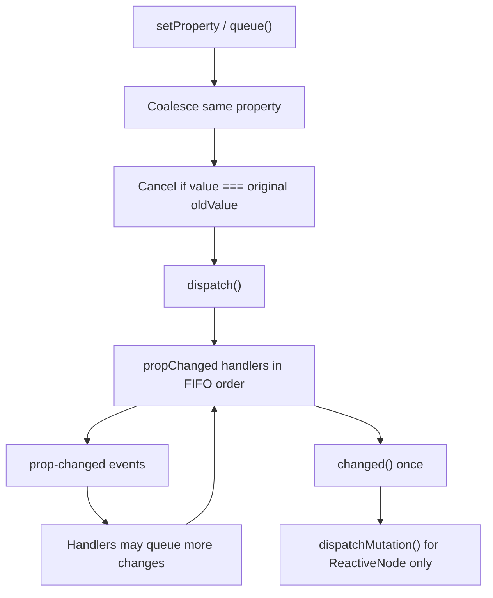

# ChangeQueue Internal Refactor

## Goal

Replace the dual `changes[] + #changeIndex` structure in [`packages/core/src/core/ChangeQueue.ts`](packages/core/src/core/ChangeQueue.ts) with one private `Map<string, Change>`, clean up the lingering `any` types, and make `dispatch()` read as three explicit phases. **No observable behavior change** — all semantics in [`packages/core/src/core/ChangeQueue.test.ts`](packages/core/src/core/ChangeQueue.test.ts) must pass unchanged.

## Invariants (must not change)



| Invariant | Why it matters |
|-----------|----------------|
| One slot per property name | Coalescing: `prop1: 0→1→2` dispatches once as `2, oldValue: 0` |
| FIFO across *different* properties | `prop1` then `prop2` handlers run in queue order |
| Cancellation | `prop1: 0→1→0` removes entry; no handler/event/`changed()` |
| Cascading during dispatch | Handler queues `prop2` mid-dispatch → processed same cycle (test at L210) |
| Re-queue same property mid-dispatch | Updates in-place; **does not** re-fire if already visited (current array behavior) |
| `dispatching` flag | `ReactiveNode.dispatchQueue()` debounces while dispatch in progress ([`ReactiveNode.ts` L457](packages/core/src/nodes/ReactiveNode.ts)) |
| Public surface | `Change`, `Changes`, `ChangeEvent`, `ChangeQueue` exports unchanged; `node`, `changes`, `dispatching`, `queue()`, `dispatch()`, `dispose()` remain |

## Proposed internal shape

```typescript
export class ChangeQueue {
  declare readonly node: ReactiveNode | IoElement
  #changes = new Map<string, Change>()
  dispatchedChange = false
  dispatching = false

  get changes(): Change[] {
    return [...this.#changes.values()]
  }
}
```

**Why Map alone is enough**
- O(1) lookup, update, delete (cancellation becomes `map.delete(property)` — removes `#removeAt` reindexing entirely)
- ES `Map` preserves insertion order → FIFO dispatch across properties
- `Changes` interface (`{ [property: string]: Change }`) stays valid as the conceptual/read shape

## Implementation steps

### 1. Replace storage + simplify `queue()`

In [`ChangeQueue.ts`](packages/core/src/core/ChangeQueue.ts):

```typescript
queue(property: string, value: unknown, oldValue: unknown) {
  const existing = this.#changes.get(property)
  if (!existing) {
    this.#changes.set(property, { property, value, oldValue })
  } else if (value === existing.oldValue) {
    this.#changes.delete(property)
  } else {
    existing.value = value
  }
}
```

Delete `#changeIndex` and `#removeAt`.

### 2. Split `dispatch()` into phases

Extract three private methods to make the lifecycle obvious:

| Phase | Method | Responsibility |
|-------|--------|----------------|
| 1 | `#dispatchQueuedChanges(): string[]` | Iterate queued changes; run `[prop]Changed` handlers + `prop-changed` events; return property names |
| 2 | `#invokeChanged()` | Call `node.changed()` with existing try/catch |
| 3 | `#invokeMutation(properties: string[])` | `dispatchMutation()` for `_isNode` only |

Main `dispatch()` becomes orchestration + guard + flag management.

**Iteration strategy for cascading** (important):

Use a growing snapshot loop that mirrors current `while (i < this.changes.length)` semantics:

```typescript
let i = 0
let snapshot = [...this.#changes.values()]
while (i < snapshot.length) {
  this.#processChange(snapshot[i], properties)
  i++
  if (this.#changes.size > snapshot.length) {
    snapshot = [...this.#changes.values()]
  }
}
```

This avoids relying on Map-iterator-during-mutation edge cases and guarantees cascading tests stay stable.

### 3. Type cleanup

Address the file-level `// TODO: Improve types!`:

- `Change<T = unknown>` (drop default `any`)
- `queue(property: string, value: unknown, oldValue: unknown)`
- `#processChange(change: Change, properties: string[])` 
- Handler lookup via narrow cast:

```typescript
const handler = (this.node as Record<string, ((change: Change) => void) | undefined>)[property + 'Changed']
```

- Keep exported `ChangeEvent` as-is (used by [`Binding.ts`](packages/core/src/core/Binding.ts) and [`EventDispatcher.ts`](packages/core/src/core/EventDispatcher.ts))

Do **not** widen scope into `Binding` or `setProperty` (roadmap A2 is a separate effort).

### 4. Preserve `dispose()` public contract

Tests expect `changeQueue.changes === undefined` after dispose ([`ChangeQueue.test.ts` L147](packages/core/src/core/ChangeQueue.test.ts)).

With a getter, override on dispose:

```typescript
dispose() {
  this.#changes.clear()
  Object.defineProperty(this, 'changes', { value: undefined, configurable: true })
  delete (this as { node?: ReactiveNode | IoElement }).node
}
```

Constructor should define the getter once; dispose replaces it with `undefined`.

### 5. Tests — minimal touch

Existing tests should pass as-is because `changes` getter returns the same array shape/JSON.

Add 1–2 targeted tests:
- **Cancellation via Map delete**: queue A, B, cancel A → only B dispatches (guards delete path)
- **Cascading growth**: explicit assertion that a change appended mid-dispatch is included (belt-and-suspenders for snapshot loop)

Run: `pnpm test:core`

## What this refactor is / isn't

| Is | Isn't |
|----|-------|
| Simpler internal model (one structure) | User-visible API redesign |
| Faster cancellation path (O(1) delete) | `setProperty` decomposition (A2) |
| Clearer dispatch phases | Event system fixes (A5) |
| Type hygiene in ChangeQueue | ReactiveNode / IoElement unification (A1) |

Performance impact remains modest — the win is **code clarity and maintainability**, not a measurable UI delta.

## Risk check before merge

- [ ] All 12 existing `ChangeQueue` tests pass
- [ ] Cascading dispatch order unchanged
- [ ] `dispose()` leaves `changes` and `node` undefined
- [ ] `dispatching` flag reset on handler/`changed()` errors (existing error tests)
- [ ] No edits needed in [`ReactiveNode.ts`](packages/core/src/nodes/ReactiveNode.ts) or [`IoElement.ts`](packages/core/src/elements/IoElement.ts) — they only call `.queue()` / `.dispatch()`

## Unresolved questions

- None for implementation — scope is confirmed as full internal cleanup with public API preserved.
