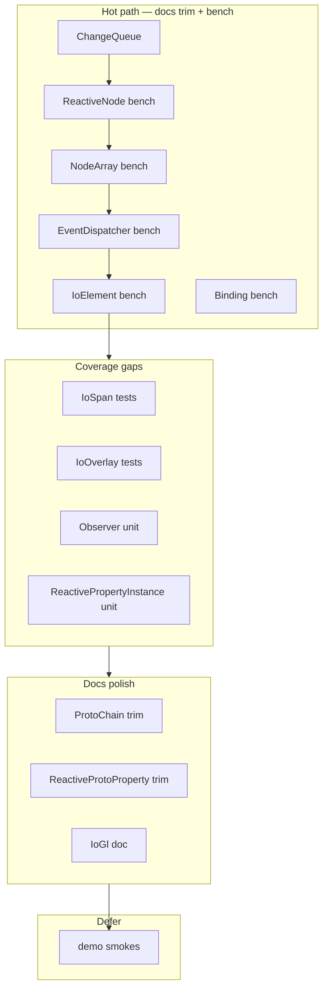

# Core Package — Docs, Tests, Benchmarks

Audit of every **class** under `packages/core/src/`. Function-only modules (`ReactiveCore`, `Queue`, `VDOM`, `Style`, decorators, `Focus`, `Nudge`, `IoNative`) are noted where tests/docs should live alongside their primary consumer class — no separate todos (not classes).

## Principles

| Domain | Rule |
|--------|------|
| **Docs** | Code is documentation. Class-level TSDoc: 1–3 sentences max — role, when to use, `@see` links. Method docs only when non-obvious. Remove `@typedef`/`@class` blocks, bullet feature lists, long `@example` blocks. Prefer `@link` over repetition. |
| **Smoke tests** | Every exported class: instantiate (or singleton access), one happy-path behavior, no throw. Runs fast in browser vitest project. |
| **Unit tests** | Maximize behavioral coverage: edge cases, error paths, integration between co-located classes. Split mega-tests (e.g. `ReactiveProperty.test.ts` 500+ lines) into focused `describe` blocks per class. |
| **Benchmarks** | Vitest `*.bench.ts` in Node project only. Hot paths: per-frame / per-input / high-frequency mutation. Skip: one-time init, I/O, DOM layout, GPU, debounced infrequent work. |

**Current baseline:** 16 test files, ~177 `it()` cases, **1** bench file (`ChangeQueue.bench.ts`).

---

## Class Inventory

| Class | File | Exported | Tests | TSDoc | Bench |
|-------|------|----------|-------|-------|-------|
| `ReactiveNode` | `nodes/ReactiveNode.ts` | yes | strong (28) | good, trim method noise | **add** |
| `IoElement` | `elements/IoElement.ts` | yes | weak (6) | good | **add** |
| `ChangeQueue` | `core/ChangeQueue.ts` | yes | good (14) | verbose → trim | **exists** |
| `ReactiveProtoProperty` | `core/ReactiveProperty.ts` | yes | indirect | verbose JSDoc style | no |
| `Observer` | `core/ReactiveProperty.ts` | no | indirect | minimal | no |
| `ReactivePropertyInstance` | `core/ReactiveProperty.ts` | no | indirect | minimal | no |
| `ProtoChain` | `core/ProtoChain.ts` | yes | good (11) | verbose property docs | no |
| `EventDispatcher` | `core/EventDispatcher.ts` | yes | good (19) | verbose | **add** |
| `Binding` | `core/Binding.ts` | yes | moderate (6) | too long | **add** |
| `NodeArray` | `core/NodeArray.ts` | yes | good (23) | good | **add** |
| `Color` | `core/Color.ts` | yes | minimal (5) | good | no |
| `StorageNode` | `nodes/Storage.ts` | yes | moderate (8) | moderate | no |
| `EmulatedLocalStorage` | `nodes/Storage.ts` | no | none direct | none | no |
| `Theme` | `nodes/Theme.ts` | yes | good (13) | brief | no |
| `IoGl` | `elements/IoGL.ts` | yes | moderate (6) | **missing** | no |
| `IoSpan` | `elements/IoSpan.ts` | yes | **none** | **missing** | no |
| `IoOverlay` | `elements/IoOverlay.ts` | singleton | minimal (1) | moderate | no |
| `IoThemeEditor` | `demos/IoThemeEditor.ts` | demo | none | none | no |
| `IoStyleContainer` | `demos/IoStyleContainer.ts` | demo | none | minimal | no |
| `IoElementInspectorDemo` | `demos/IoElementInspectorDemo.ts` | demo | none | none | no |
| `IoChangeVisualization` | `demos/IoChangeVisualization.ts` | demo | none | none | no |
| `SimulatedNode` | `demos/IoChangeVisualization.ts` | demo | none | none | no |
| `ForceDirectedLayout` | `demos/IoChangeVisualization.ts` | demo | none | none | no |

---

## Per-Class Evaluation

### ReactiveNode
- **Docs:** Class doc is the target style. Trim redundant comments on static getters; add one-liners for exported free functions (`bind`, `setProperty`, `dispatchMutation`) in `ReactiveNode.ts`.
- **Tests:** Best-covered class. Gaps: `_parents` synthetic bubbling to DOM ancestors, `NODES.active`/`disposed` lifecycle, `applyProperties` with partial/null, `dispose()` idempotency smoke.
- **Bench:** `setProperty` → `ChangeQueue.queue` → `dispatch` with 50 props × 1000 iterations — complements ChangeQueue bench at integration boundary.

### IoElement
- **Docs:** Class doc good. Document `render`, `traverse`, `dispose`, `applyProperties` with single-line behavior notes.
- **Tests:** Major gap vs ReactiveNode. Missing: VDOM render diff, child disposal, `ResizeObserver`, custom element `connectedCallback`/`disconnectedCallback`, static `Style` adoption smoke.
- **Bench:** `render()`/`traverse()` with 100–500 child VDOM nodes — validates C2 keyed diff hot path.

### ChangeQueue
- **Docs:** Cut 15-line block to ~4 lines (FIFO, coalesce, dispatch handlers).
- **Tests:** Add error isolation when handler throws, re-entrancy during `dispatching`, property cancel (value reverted to oldValue).
- **Bench:** Already covers queue/coalesce/dispatch/cascade — extend with "50 props coalesced to 1" realistic batch.

### ReactiveProtoProperty
- **Docs:** Remove `@typedef`/`@class`; one sentence + typed fields speak for themselves.
- **Tests:** Logic tested inside monolithic `ReactiveProperty.test.ts` — extract dedicated `ReactiveProtoProperty` describes for each loose-def input shape.

### Observer
- **Docs:** One line: tracks mutation observation mode and listener wiring.
- **Tests:** No direct tests. Cover all four `ObservationType` paths, idempotent `start`/`stop`, window listener refcount across multiple object props.

### ReactivePropertyInstance
- **Docs:** Expand from "constructed from ReactiveProtoProperty" to note getter/setter side effects (queue, reflect, observer).
- **Tests:** Setter dispatches queue; reflect writes attribute; binding reference; dispose detaches observer.

### ProtoChain
- **Docs:** Class doc OK; delete per-field paragraph docs on `constructors`, `properties`, etc.
- **Tests:** Solid. Add smoke: double `Register()` doesn't re-init. Cover `@Style` decorator + static `Style` merge.

### EventDispatcher
- **Docs:** Shorten; keep note on proto vs prop vs added listener buckets and last-wins.
- **Tests:** Good coverage. Gaps: `IoSyntheticEvent.path`, DOM-only `EventTarget` mode, `releaseEventDispatcher` integration.
- **Bench:** Deep chain (20 nodes) synthetic dispatch — measures bubble walk.

### Binding
- **Docs:** Reduce to hub-and-spoke one-liner + tiny `@example`.
- **Tests:** Expand circular binding, 1→N targets, dispose, NaN passthrough, incompatible types warning path.
- **Bench:** 1 source → 16 targets property sync.

### NodeArray
- **Docs:** Already concise — keep.
- **Tests:** Good. Add: `sort`/`reverse` mutation dispatch, `toJSON`/`applyJSON`, constructor with pre-filled items.
- **Bench:** `push`×1000 and `splice(0,1)`×1000 — proxy + mutation dispatch overhead.

### Color
- **Docs:** Good class doc; optional method one-liners.
- **Tests:** Expand hex formats, alpha, `toCss` channel rounding.
- **Bench:** none — not a hot path.

### StorageNode / EmulatedLocalStorage
- **Docs:** Shorten factory `@example`; document singleton dedup by `(storage,key)`.
- **Tests:** EmulatedLocalStorage permission grant/revoke; hash storage; IoValue hydrate; factory returns same instance.
- **Bench:** none — I/O bound.

### Theme
- **Docs:** Note singleton + CSS variable mapping in 2 sentences; remove debug `console.log` in production path (separate cleanup).
- **Tests:** Good theme tests exist. Smoke: `$Theme`/`ThemeSingleton` export wiring.
- **Bench:** none — debounced, user-triggered.

### IoGl
- **Docs:** Add class doc (WebGL-backed IoElement, shared context).
- **Tests:** 6 tests — expand uniform updates, program cache hit, graceful skip when no WebGL.
- **Bench:** skip — GPU/context not meaningful in Node bench.

### IoSpan
- **Docs:** Add one line (inline text element, `value` prop).
- **Tests:** **Missing file** — add `IoSpan.test.ts` smoke + value binding.
- **Bench:** none.

### IoOverlay
- **Docs:** Trim to singleton overlay behavior (expanded, collapse on click).
- **Tests:** 1 test only — expand expanded/collapsed, child `expanded` reset, focus restore.
- **Bench:** none.

### Demo classes (4 files, 6 classes)
- **Docs:** `@internal` one-liner each — not public API.
- **Tests:** Smoke construct only; no bench.
- **Priority:** lowest — after exported surface complete.

---

## Companion Modules (no class todos)

| Module | Doc/test home | Bench candidate? |
|--------|---------------|------------------|
| `ReactiveCore.ts` | `ReactiveNode.test.ts` — `isReactiveOwner`, parent graph | no |
| `Queue.ts` | `Queue.test.ts` (15 tests, good) | **optional** throttle/debounce tick |
| `VDOM.ts` | `VDOM.test.ts` (19 tests) | **yes** — `constructElement`/`filterVDOMElements` (add `VDOM.bench.ts`, not a class) |
| `Style.ts` | `Style.test.ts` (8 tests) | no — parse once at register |
| `Register`, `Property`, `Style` decorators | `ProtoChain.test.ts` / `ReactiveProperty.test.ts` | no |
| `Focus.ts`, `Nudge.ts` | new `Focus.test.ts`, `Nudge.test.ts` when touched | no |
| `IoNative.ts` | smoke in `IoElement.test.ts` or dedicated file | no |

---

## Suggested Execution Order

1. Trim verbose TSDoc on `ChangeQueue`, `Binding`, `ProtoChain`, `ReactiveProtoProperty` (quick wins).
2. Add missing tests: `IoSpan`, `IoOverlay`, `Observer`, `ReactivePropertyInstance`.
3. Expand `IoElement` render/traverse tests.
4. Add benches: `ReactiveNode`/`Binding`/`NodeArray`/`EventDispatcher`/`IoElement`; optional `VDOM.bench.ts`.
5. Demo smokes last.

---

## Bench File Targets (performance-critical only)

| File | Scenarios |
|------|-----------|
| `ChangeQueue.bench.ts` | exists — extend coalesced batch |
| `ReactiveNode.bench.ts` | `setProperty` × N props, bind sync |
| `NodeArray.bench.ts` | push, splice, indexed assign |
| `EventDispatcher.bench.ts` | synthetic dispatch depth 20 |
| `IoElement.bench.ts` | render 200 nodes, re-render 10 changed |
| `Binding.bench.ts` | 1→16 target propagation |
| `VDOM.bench.ts` | constructElement 500 nodes (module, not class) |

---

## Unresolved Questions

- Split `ReactiveProperty.test.ts` into per-class files vs nested `describe` blocks?
- Include demo classes in CI smoke suite or exclude via vitest `include` pattern?
- `Theme.ts` debug `console.log('theme id', ...)` — remove as part of docs pass or separate chore?
- Bench regression baseline: commit `benchmarks/results.json` on every PR or nightly only?
