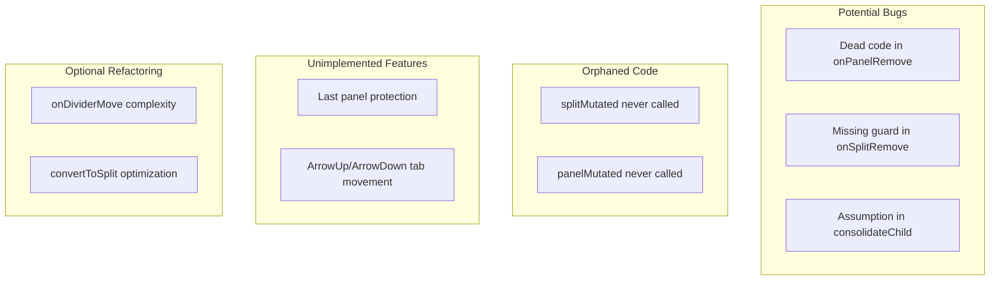

# IoSplit Improvements Plan

## Issues Overview



---

## 1. Dead Code in `onPanelRemove` (Bug)

**File:** [`packages/layout/src/elements/IoSplit.ts`](packages/layout/src/elements/IoSplit.ts) line 175

```typescript
onPanelRemove(event: CustomEvent) {
  if (event.detail.panel === this.split) return  // <-- Always false
```

**Problem:** Compares a `Panel` to a `Split`, which is always `false`. The `io-panel-remove` event is dispatched from IoPanel with `{panel: this.panel}` where `this.panel` is a `Panel` instance.**Context:** Looking at [`packages/layout/src/elements/IoPanel.ts`](packages/layout/src/elements/IoPanel.ts) line 138:

```typescript
this.dispatch('io-panel-remove', {panel: this.panel}, true)
```

**Action:** Determine if this was meant to be a different check (perhaps preventing self-handling like in `onSplitRemove`) or remove as dead code. The pattern in `onSplitRemove` is `if (event.detail.split === this.split) return` which makes sense for preventing self-handling of bubbling events.---

## 2. Missing Guard in `onSplitRemove` (Bug)

**File:** [`packages/layout/src/elements/IoSplit.ts`](packages/layout/src/elements/IoSplit.ts) lines 194-195

```typescript
const index = this.split.children.indexOf(event.detail.split)
this.split.children.splice(index, 1)
```

**Problem:** If `indexOf` returns `-1` (split not found), `splice(-1, 1)` removes the **last** element unintentionally.**Action:** Add guard:

```typescript
const index = this.split.children.indexOf(event.detail.split)
if (index === -1) return
this.split.children.splice(index, 1)
```

---

## 3. Assumption in `consolidateChild` (Robustness)

**File:** [`packages/layout/src/elements/IoSplit.ts`](packages/layout/src/elements/IoSplit.ts) line 228

```typescript
consolidateChild(childSplit: Split) {
  const index = this.split.children.indexOf(childSplit)
  const soleChild = childSplit.children[0]  // <-- Assumes children[0] exists
```

**Context:** Called from `onSplitConsolidate` when `this.split.children.length === 1`. The assumption is that `childSplit` has exactly one child, but defensive coding would verify this.**Action:** Add guard:

```typescript
consolidateChild(childSplit: Split) {
  const index = this.split.children.indexOf(childSplit)
  if (index === -1 || childSplit.children.length === 0) return
  const soleChild = childSplit.children[0]
```

---

## 4. Orphaned `splitMutated` Method (Dead Code)

**File:** [`packages/layout/src/elements/IoSplit.ts`](packages/layout/src/elements/IoSplit.ts) lines 262-267

```typescript
splitMutated() {
  this.debounce(this.splitMutatedDebounced)
}
splitMutatedDebounced() {
  this.changed()
}
```

**Problem:** Never called. The README mentions it as a mutation handler pattern, but it's not wired to the `split` property's mutation events.**Context:** This should be invoked when `this.split` (the domain model) mutates. The naming convention suggests it should be `splitMutated` for the `split` property, but the io-gui framework requires explicit wiring or the handler should be auto-invoked if the property has the right observer configuration.**Action:** Either:

- Wire it up properly to respond to `split` mutations
- Remove if the current event-based approach (consolidate/remove events) is sufficient

---

## 5. Orphaned `panelMutated` Method in IoPanel (Related)

**File:** [`packages/layout/src/elements/IoPanel.ts`](packages/layout/src/elements/IoPanel.ts) line 155

```typescript
panelMutated() {
  this.changed()
}
```

**Problem:** Same issue - defined but never called. Should respond to `panel` property mutations.**Action:** Either wire up or remove.---

## 6. TODO: Last Panel Protection (Line 50)

**File:** [`packages/layout/src/elements/IoSplit.ts`](packages/layout/src/elements/IoSplit.ts) line 50

```typescript
// TODO: Make sure one panel is available even when all tabs are removed.
```

**Current protection:** IoPanel (line 132-139) prevents removal of the last panel at root level:

```typescript
const isRootPanel = parentSplit.parentElement instanceof IoLayout &&
  parentSplit.split.children.length === 1
if (!isRootPanel) {
  this.dispatch('io-panel-remove', {panel: this.panel}, true)
}
```

**Gap:** This only protects direct children of the root IoLayout. Deeply nested single panels may not be protected.**Action:** Implement comprehensive protection that:

- Traverses up to find if this is the absolute last panel in the layout
- OR ensures at least one panel always exists by preventing the cascade that would remove it

---

## 7. TODO: ArrowUp/ArrowDown Tab Movement (IoPanel)

**File:** [`packages/layout/src/elements/IoPanel.ts`](packages/layout/src/elements/IoPanel.ts) lines 76-83

```typescript
case 'ArrowUp': {
  // TODO: move tab to panel above or split the panel
  break
}
case 'ArrowDown': {
  // TODO: move tab to panel below or split the panel
  break
}
```

**Action:** Implement keyboard-based tab movement to adjacent panels or panel splitting.---

## 8. Optional: `onDividerMove` Complexity

**File:** [`packages/layout/src/elements/IoSplit.ts`](packages/layout/src/elements/IoSplit.ts) lines 56-162This ~100 line method could be split into helper methods for readability:

- `collectSplitMeasurements()` - lines 66-88
- `calculateSpaceDistribution()` - lines 90-116
- `applyResizeSizes()` - lines 118-161

**Priority:** Low - functionality is correct, this is purely for maintainability.---

## 9. Optional: `convertToSplit` Minor Optimization

**File:** [`packages/layout/src/elements/IoSplit.ts`](packages/layout/src/elements/IoSplit.ts) line 221

```typescript
// Current:
const newSplit = new Split({type: 'split', orientation, children: []})
newSplit.children.push(first, second)

// Could be:
const newSplit = new Split({type: 'split', orientation, children: [first, second]})
```

Note: May need to pass raw props `{type: 'panel', tabs: [...]}` rather than Panel instances depending on Split constructor behavior.---

## Implementation Priority

| Priority | Issue | Impact |

|----------|-------|--------|

| High | #2 Missing guard in onSplitRemove | Could remove wrong child |

| High | #3 Guard in consolidateChild | Runtime error if empty |

| Medium | #1 Dead code in onPanelRemove | Code clarity |

| Medium | #6 Last panel protection | UX edge case |

| Low | #4, #5 Orphaned mutation handlers | Dead code |

| Low | #7 Arrow key tab movement | Feature enhancement |