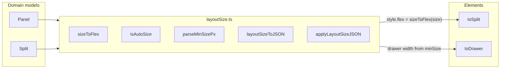

# Layout size reflector (replace flex)

## Goal

Replace opaque CSS `flex` strings on layout nodes with two domain properties:

| Property | Type | Default | CSS mapping |
|----------|------|---------|-------------|
| `size` | `string` | `"auto"` | `"auto"` → `flex: 1 1 auto`; `"200px"` / `"50%"` → `flex: 0 1 200px` / `flex: 0 1 50%` |
| `minSize` | `string` | `"240px"` | Drawer collapse + split min-fit math only (not flex basis) |

`toJSON` omits properties equal to defaults (same pattern as `orientation` today).

Breaking change per your choice: **`flex` removed entirely** from types, nodes, and persisted JSON.

Grow weights dropped: all former `N 1 auto` cases become `size: "auto"`.

## Architecture



## 1. New reflector utility

Create [`packages/layout/src/utils/layoutSize.ts`](packages/layout/src/utils/layoutSize.ts) (replaces [`packages/layout/src/utils/flex.ts`](packages/layout/src/utils/flex.ts)):

```typescript
export const DEFAULT_SIZE = 'auto'
export const DEFAULT_MIN_SIZE = '240px'

export type LayoutSizeData = { size?: string; minSize?: string }

export function sizeToFlex(size: string): string
export function isAutoSize(size: string): boolean          // replaces hasFlexGrow
export function isValidSize(size: string): boolean         // auto | Npx | N%
export function isValidMinSize(minSize: string): boolean   // Npx | N%
export function parseMinSizePx(minSize: string, containerSize: number): number
export function layoutSizeToJSON(node: { size: string; minSize: string }): Partial<LayoutSizeData>
export function applyLayoutSizeProps(data: LayoutSizeData): { size: string; minSize: string }
export function ensureOneChildHasAutoSize(children: Array<{ size: string }>): void
```

Validation in `sizeChanged` / `minSizeChanged` handlers (debug-only error + reset to default, mirroring current `flexChanged`).

Delete `flex.ts` after migration.

Add [`packages/layout/src/utils/layoutSize.test.ts`](packages/layout/src/utils/layoutSize.test.ts) covering mapping, validation, px/% minSize parsing, and default omission helpers.

## 2. Domain model changes

### Shared on [`Panel.ts`](packages/layout/src/nodes/Panel.ts) and [`Split.ts`](packages/layout/src/nodes/Split.ts)

- Remove `flex` from `PanelData` / `SplitData` and `@Property`
- Add:

```typescript
@Property({ type: String, value: DEFAULT_SIZE })
declare size: string

@Property({ type: String, value: DEFAULT_MIN_SIZE })
declare minSize: string
```

- Replace `flexChanged` with `sizeChanged` + `minSizeChanged` (call reflector validators)
- `toJSON`: use `layoutSizeToJSON(this)` — omit `size` when `"auto"`, omit `minSize` when `"240px"`
- `applyJSON`: set `size` / `minSize` via `applyLayoutSizeProps(data)` — no `flex` fallback

Update commented future code in both files (`ensureOneChildGrows` → `ensureOneChildHasAutoSize`, `soleChild.flex = '1 1 auto'` → `soleChild.size = 'auto'`).

## 3. Element layer changes

### [`IoSplit.ts`](packages/layout/src/elements/IoSplit.ts)

- Remove local `parseFlexBasis`; import from `layoutSize.ts`
- **`calculateCollapsedDrawers`**: sum `parseMinSizePx(child.minSize, size)` instead of parsing flex basis
- **`mutated`**: `style: { flex: sizeToFlex(child.size) }`
- **`onDividerMoveEnd`**: write `childmodel.size = \`${childSize}px\`` for all children (simplified; grow weights dropped)
- Replace `hasFlexGrow(child.flex)` → `isAutoSize(child.size)` everywhere
- Rename reflected attribute `hasVisibleFlexGrow` → `hasVisibleAutoSize` (property + CSS selector `:host:not([hasvisibleautosize])`)

### [`IoDrawer.ts`](packages/layout/src/elements/IoDrawer.ts)

- Drawer width: `parseMinSizePx(this.child.minSize, availableSize)` instead of `parseFlexBasis(this.child.flex)`

## 4. Test updates

| File | Changes |
|------|---------|
| [`Panel.test.ts`](packages/layout/src/nodes/Panel.test.ts) | `flex` → `size`/`minSize`; default/serialization assertions |
| [`Split.test.ts`](packages/layout/src/nodes/Split.test.ts) | same + child size preservation |
| [`IoSplit.test.ts`](packages/layout/src/elements/IoSplit.test.ts) | JSON fixtures + `hasVisibleAutoSize` attribute |
| [`IoDrawer.test.ts`](packages/layout/src/elements/IoDrawer.test.ts) | `size: '200px'` fixtures; minSize-driven drawer width tests |

Run: `pnpm test:layout`

## 5. Demo / example migration

### Flex → size/minSize mapping rules

| Old flex | New |
|----------|-----|
| `'1 1 auto'`, `'2 1 auto'`, `'1 1 100%'` | omit `size` |
| `'0 0 Npx'` / `'0 1 Npx'` | `size: 'Npx'` |
| `'1 1 Npx'` (grow + px basis) | omit `size`, `minSize: 'Npx'` |
| `'1 1 N%'` / `'1 1 50%'` / `'1 1 33.33%'` | `size: 'N%'` |

### Files (11 total)

- [`packages/layout/src/demos/IoLayoutDemo.ts`](packages/layout/src/demos/IoLayoutDemo.ts)
- All 10 three.js examples under [`packages/three/src/demos/examples/`](packages/three/src/demos/examples/):
  - `IoVolumePerlinExample.ts`, `IoGeometriesExample.ts`, `IoGeometryConvexExample.ts`
  - `IoCameraExample.ts`, `IoCameraLogarithmicDepthBufferExample.ts`, `IoBackdropAreaExample.ts`
  - `IoAnimationSkinningBlendingExample.ts`, `IoAnimationSkinningAdditiveBlendingExample.ts`
  - `IoAnimationRetargetingExample.ts`, `IoAnimationKeyframesExample.ts`

Concrete IoLayoutDemo example:

```typescript
// before: flex: '0 0 350px'
size: '350px'
// before: flex: '1 1 auto'  → omit size entirely
```

## 6. Docs

Update terminology in:

- [`packages/layout/CONTEXT.md`](packages/layout/CONTEXT.md) — replace **Flex** section with **Size** / **MinSize**
- [`packages/layout/README.md`](packages/layout/README.md) — type defs, JSON examples, divider/drawer sections

## Out of scope

- `dist/` artifacts (rebuilt via `pnpm build`)
- CSS `flex` on element `:host` styles (unchanged — those are view chrome, not domain model)
- Legacy `flex` migration in `applyJSON`

## Unresolved questions

- None (grow weights: drop; legacy flex: breaking change — confirmed)
