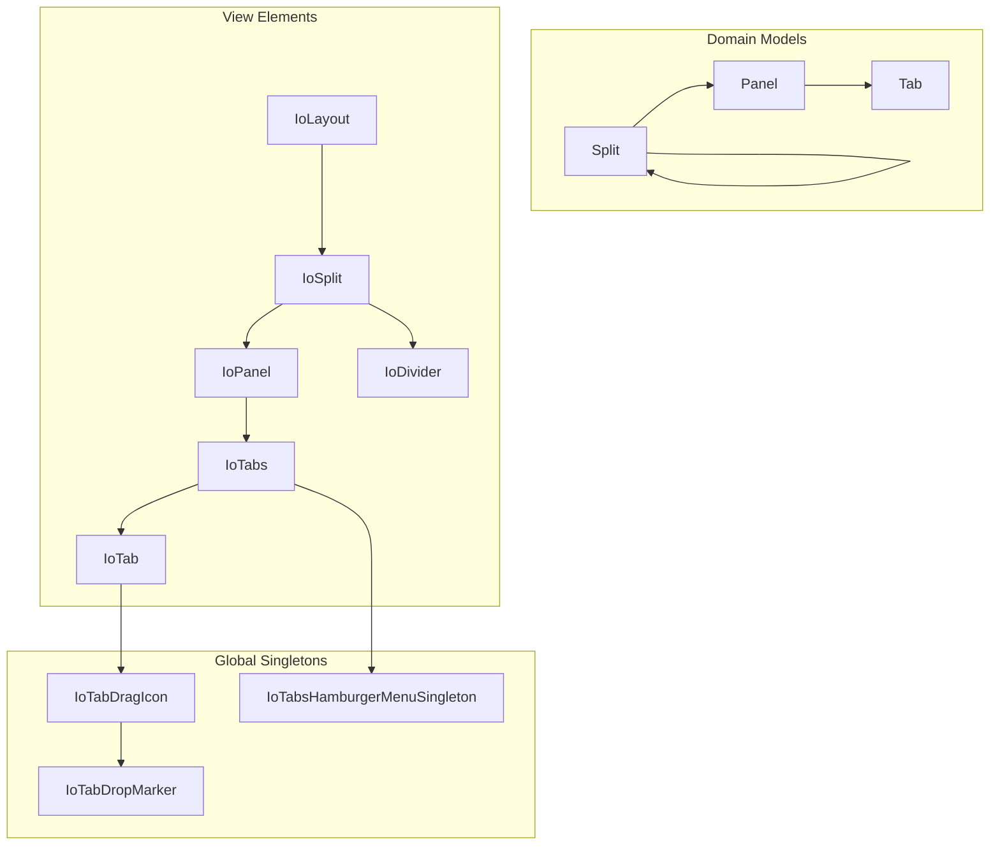

# Layout System Investigation and Improvements

## Analysis Summary

After deep analysis of the layout package, I've identified several bugs, edge cases, and areas needing improved test coverage.

### Architecture Overview



---

## Identified Bugs

### 1. IoDivider Pointer Event Handling (Critical)

**File:** [`packages/layout/src/elements/IoDivider.ts`](packages/layout/src/elements/IoDivider.ts)The `onPointerleave` handler incorrectly cancels the drag operation even when pointer is captured:

```91:110:packages/layout/src/elements/IoDivider.ts
  onPointerleave(event: PointerEvent) {
    event.preventDefault()
    this.removeEventListener('pointermove', this.onPointermove)
    // ... removes listeners and sets pressed=false
```

**Fix:** When pointer is captured, `pointerleave` shouldn't fire. However, if it does (browser inconsistency), we should check `hasPointerCapture()` before cleaning up.

### 2. Global Query Selectors in Tab Drag (High Impact)

**File:** [`packages/layout/src/elements/IoTab.ts`](packages/layout/src/elements/IoTab.ts)Lines 180-214 use `document.querySelectorAll('io-tabs')` and `document.querySelectorAll('io-panel')` which queries ALL layout instances on the page. This could cause incorrect drop targets with multiple layouts.**Fix:** Scope queries to the containing IoLayout ancestor.

### 3. Singleton Initialization with setTimeout (Fragile)

**Files:**

- [`packages/layout/src/elements/IoTabDropMarker.ts`](packages/layout/src/elements/IoTabDropMarker.ts) (line 93)
- [`packages/layout/src/elements/IoTabsHamburgerMenuSingleton.ts`](packages/layout/src/elements/IoTabsHamburgerMenuSingleton.ts) (line 124)
```typescript
setTimeout(() => {
  document.body.appendChild(tabDropMarkerSingleton)
}, 100)
```


**Fix:** Use lazy initialization pattern or DOMContentLoaded listener.

### 4. Overflow Detection Requires Optional Property

**File:** [`packages/layout/src/elements/IoTabs.ts`](packages/layout/src/elements/IoTabs.ts)

```75:79:packages/layout/src/elements/IoTabs.ts
  onResized() {
    const addMenu = this.querySelector('.add-tab')
    if (!addMenu) return  // Overflow detection silently fails
```

**Fix:** Implement fallback overflow detection using last tab element when addMenu is absent.---

## Edge Cases to Address

### 1. Flex-grow Preservation on Panel Removal

**File:** [`packages/layout/src/elements/IoSplit.ts`](packages/layout/src/elements/IoSplit.ts) (TODO on line 9-16)When removing a flex panel from between two fixed panels, neither remaining panel fills space.

### 2. Last Tab in Layout Protection

Current protection only covers the simple case. Nested scenarios need verification:

- Single panel with one tab in deeply nested split
- Removing tab that would cascade to empty layout

### 3. ~~Drop Marker Positioning with Scroll~~ (Non-issue)

**File:** [`packages/layout/src/elements/IoTabDropMarker.ts`](packages/layout/src/elements/IoTabDropMarker.ts)Uses `position: fixed` with `getBoundingClientRect()`. Both use viewport-relative coordinates, so they match regardless of scroll position. Tested and confirmed working with scrolled panel contents.**Edge case note:** Would break only if an ancestor has `transform`/`perspective`/`filter` CSS (creates new containing block for `fixed`), but this is a known CSS quirk, not a layout system bug.

### 4. Duplicate Tab IDs Across Panels

Current behavior silently removes duplicates within a panel. Cross-panel duplicate handling needs definition.---

## README Additions

The following information should be added to the README:

1. **Multiple Layout Instances** - Document limitations with global singletons
2. **Tab ID Uniqueness** - Document the duplicate ID handling behavior
3. **Minimum Panel Sizes** - Document the `ThemeSingleton.fieldHeight` based minimums
4. **Storage Serialization Limitations** - Document what isn't persisted (e.g., transient drag state)

---

## Test Implementation Plan

### Phase 1: Domain Model Tests

**Tab Tests** (`Tab.test.ts`):

- Construction with all property combinations
- Label defaulting to id
- toJSON/fromJSON roundtrip
- Property change events

**Panel Tests** (`Panel.test.ts`):

- Tab auto-selection on construction
- setSelected with valid/invalid ids
- getSelected behavior
- Tab array mutations and events
- toJSON/fromJSON roundtrip
- dispose cleanup

**Split Tests** (extend `IoSplit.test.ts`):

- Construction consolidation (already covered)
- Deep nesting consolidation
- Mixed Panel/Split children
- toJSON/fromJSON roundtrip
- dispose cleanup

### Phase 2: Element Interaction Tests

**IoDivider Tests** (`IoDivider.test.ts`):

- Pointer capture and release
- Event dispatching (io-divider-move, io-divider-move-end)
- Touch event handling
- Visual state (pressed attribute)

**IoPanel Tests** (`IoPanel.test.ts`):

- Tab selection via click
- Tab removal via keyboard
- Tab reordering via keyboard
- addTab with duplicates
- removeTab with last-tab protection
- moveTabToSplit scenarios

**IoTabs Tests** (`IoTabs.test.ts`):

- Overflow detection triggering
- Overflow hysteresis behavior
- Tab rendering from NodeArray

### Phase 3: Drag and Drop Tests

**IoTab Drag Tests** (`IoTab.test.ts`):