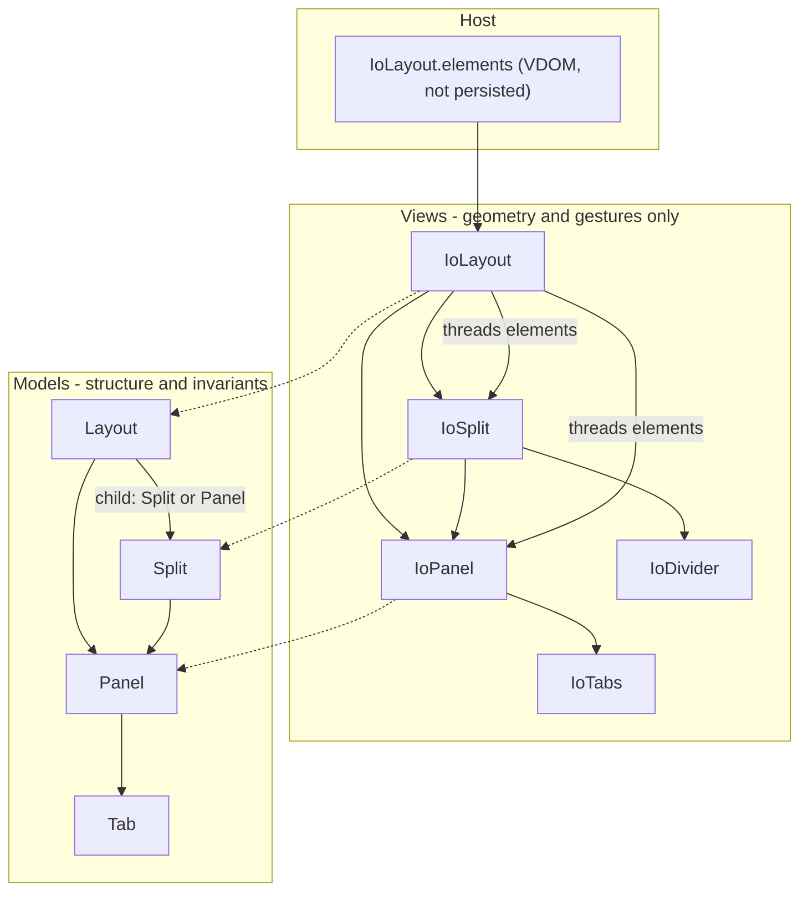

# Layout System Migration Plan

## Target architecture



**Responsibility seam (ADR-0001):**

| Layer | Owns |
|-------|------|
| `Layout` | Tree-wide ops (`moveTab`), root normalization (panel survives, absorb lone child as `Split \| Panel`) |
| `Panel` | Local tab ops (`addTab`, `removeTab`, `moveTab`, `setSelected`) |
| `Split` | Local split ops + `normalize()` (drop empty children, consolidate, flex-grow invariant) |
| `IoLayout` / `IoSplit` / `IoPanel` | Render, divider resize math, drawer collapse, drag hit-testing, focus |
| `IoTabDragIconSingleton` | **Exception:** keeps `IoPanel` element refs for drop execution (ADR-0001) |

## Already done (skip in implementation)

- [packages/layout/CONTEXT.md](packages/layout/CONTEXT.md) glossary + [ADRs 0001–0003](packages/layout/docs/adr/)
- `NodeArray.dispose(deep = true)` in [packages/core/src/core/NodeArray.ts](packages/core/src/core/NodeArray.ts) + `ReactiveObject.dispose(true)`
- Curated `addMenuOption` removed; add-tab always from `elements` ids ([IoPanel.getAddMenuOption](packages/layout/src/elements/IoPanel.ts))
- Centralized `isValidFlex` / `DEFAULT_FLEX` in [packages/layout/src/nodes/flex.ts](packages/layout/src/nodes/flex.ts)

## Phase 1 — Introduce `Layout` + `IoLayout` (non-breaking shell)

**Add model** [packages/layout/src/nodes/Layout.ts](packages/layout/src/nodes/Layout.ts):

- `LayoutProps`: `{ type: 'layout', child: SplitProps | PanelProps }`
- Single reactive property `child: Split | Panel` (not `NodeArray`)
- Factory in constructor: `child.type === 'panel' ? new Panel(...) : new Split(...)`
- `toJSON()` / `applyJSON()` — child serializes as existing `SplitProps | PanelProps`
- Stub methods (Phase 4): `normalize()`, `moveTab(...)`, `findPanel(tab)`

**Add view** [packages/layout/src/elements/IoLayout.ts](packages/layout/src/elements/IoLayout.ts):

- Props: `layout: Layout`, `elements: VDOMElement[]`, optional `editable`
- `mutated()`: render `ioSplit({ split, elements })` or `ioPanel({ panel, elements })` from `layout.child` type
- Pass `layout` reference down (new optional prop on `IoSplit`/`IoPanel` for later wiring) OR store on `IoLayout` and resolve via `closest('io-layout')` initially

**Exports:** [packages/layout/src/index.ts](packages/layout/src/index.ts) — export `Layout`, `LayoutProps`, `IoLayout`, `ioLayout`

**Demo:** [packages/layout/src/demos/IoLayoutDemo.ts](packages/layout/src/demos/IoLayoutDemo.ts) — wrap persisted `Split` in `new Layout({ type: 'layout', child: split.toJSON() })`, mount `ioLayout` instead of root `ioSplit`. Bump Storage key version.

**Tests:** `Layout.test.ts` — construct, JSON round-trip, `child` is `Split | Panel`.

Nested `IoSplit` usage unchanged; only the **root** becomes `IoLayout`.

---

## Phase 2 — Shared flex helpers + `Split.normalize()`

**Extend** [packages/layout/src/nodes/flex.ts](packages/layout/src/nodes/flex.ts):

- Move `hasFlexGrow(flex)` from [IoSplit.ts](packages/layout/src/elements/IoSplit.ts) (pure string parse — model-safe)
- Add `ensureOneChildGrows(children: { flex: string }[])` — promote index `min(1, len-1)` when none grow (port from `IoSplit.ensureOneHasFlexGrow` flex-string half only)

**Add** `Split.normalize()` in [packages/layout/src/nodes/Split.ts](packages/layout/src/nodes/Split.ts):

- Run inside `children.withInternalOperation` + local `_normalizing` flag (prevent re-entrancy loops)
- **Synchronous** at end of structural methods (ADR-0002)
- Steps (port from [IoSplit.ts](packages/layout/src/elements/IoSplit.ts) `onPanelRemove` / `consolidateChild` / `ensureOneHasFlexGrow`):
  1. Remove empty `Panel` children
  2. Remove empty `Split` children
  3. Consolidate single-child nested `Split` into parent (reuse/adapt existing `consolidateChildren` logic for one level at a time; loop until stable)
  4. `ensureOneChildGrows` on remaining children
- Call `normalize()` from new structural methods; keep debounced `childrenMutated()` for **render** propagation only (not repair)

**View:** `IoSplit.ensureOneHasFlexGrow()` shrinks to **drawer-aware** `hasVisibleFlexGrow` only (CSS fallback when grow child is in collapsed drawer) — no flex-string mutation.

**Tests:** [Split.test.ts](packages/layout/src/nodes/Split.test.ts) — model-only cases currently in [IoSplit.test.ts](packages/layout/src/elements/IoSplit.test.ts) (`consolidateChild`, empty panel removal, flex-grow promotion). No DOM.

---

## Phase 3 — `Panel` structural methods

**Add to** [packages/layout/src/nodes/Panel.ts](packages/layout/src/nodes/Panel.ts):

```typescript
addTab(tab: Tab, index?: number): void      // dedupe id in panel, select added tab
removeTab(tab: Tab): void                   // reselect neighbor; empty panel -> parent Split.normalize()
moveTab(tab: Tab, index: number): void      // reorder + select
```

- Port logic from [IoPanel.ts](packages/layout/src/elements/IoPanel.ts) `addTab` / `removeTab` / `moveTab`
- **Remove** `isRootPanel` DOM sniffing and `io-panel-remove` dispatch — empty panel removal is `Split.normalize()`'s job; root survival is `Layout.normalize()`'s job (Phase 4)
- `removeTab` on last tab: call parent `Split.normalize()` via `_parents` walk (Core already maintains upward links)

**Thin IoPanel:** keyboard/click handlers call `this.panel.addTab(...)` etc.; keep `focusTabDebounced` (DOM).

**Tests:** [Panel.test.ts](packages/layout/src/nodes/Panel.test.ts) — add/remove/move/selection; empty panel triggers parent normalize.

---

## Phase 4 — `Layout` tree-wide ops + root normalization

**Implement** [packages/layout/src/nodes/Layout.ts](packages/layout/src/nodes/Layout.ts):

**`normalize()`** (synchronous, re-entrancy guarded):

- If `child` is `Split` with one child after split.normalize(): promote — `Panel` becomes `layout.child`; lone `Split` gets absorbed (orientation/children hoisted per consolidation rules in CONTEXT.md)
- If tree has no panels left: set `child = new Panel({ type: 'panel', tabs: [] })` (terminal empty panel)

**`moveTab(tab, targetPanel, direction: SplitDirection)`** — port from [IoSplit.moveTabToSplit](packages/layout/src/elements/IoSplit.ts):

- `center`: remove from source panel, `targetPanel.addTab(tab)`
- edges: split target panel (same vs cross-orientation cases in current `moveTabToSplit` / `convertToSplit`)
- Move **Tab instance** (not pool recreate)
- End with `layout.normalize()` + affected splits' `normalize()`

**Helpers:** `findPanel(tab: Tab): Panel | null` — walk tree from `layout.child`

**Tests:** `Layout.test.ts` — moveTab center/edges, single-panel collapse to `Layout.child: Panel`, empty-panel survival, JSON round-trip with both child shapes.

Mark [ADR-0002](packages/layout/docs/adr/0002-reactive-split-normalization.md) **accepted** when DOM events deleted.

---

## Phase 5 — Wire views; delete DOM structural events

**IoPanel** [packages/layout/src/elements/IoPanel.ts](packages/layout/src/elements/IoPanel.ts):

- Resolve `layout` from prop or `closest('io-layout')`
- `moveTabToSplit` → `layout.moveTab(tab, this.panel, direction)`
- Drop `io-panel-remove` dispatch

**IoSplit** [packages/layout/src/elements/IoSplit.ts](packages/layout/src/elements/IoSplit.ts):

- Remove listeners: `io-panel-remove`, `io-split-remove`, `io-split-consolidate`
- Remove methods: `onPanelRemove`, `onSplitRemove`, `onSplitConsolidate`, `consolidateChild`, `convertToSplit`, `moveTabToSplit`
- `onDividerMoveEnd`: write flex to model, then `this.split.normalize()`

**IoTab** [packages/layout/src/elements/IoTab.ts](packages/layout/src/elements/IoTab.ts):

- Drag root: `closest('io-layout')` instead of outermost `io-split` walk
- Pass `IoLayout` to `IoTabDragIconSingleton.updateDrag`

**IoTabDragIcon** [packages/layout/src/elements/IoTabDragIcon.ts](packages/layout/src/elements/IoTabDragIcon.ts):

- `detectDropTargets` scoped to layout element subtree
- `endDrag` → `layout.moveTab(...)` via panel elements (keep element-ref exception)

**Migrate tests:** Move DOM structural-event tests from [IoSplit.test.ts](packages/layout/src/elements/IoSplit.test.ts) / [IoPanel.test.ts](packages/layout/src/elements/IoPanel.test.ts) to model tests; keep integration tests for drag/divider rendering in [IoSplit.integration.test.ts](packages/layout/src/elements/IoSplit.integration.test.ts).

Run: `pnpm exec vitest run packages/layout` (expect ~400+ tests green).

---

## Phase 6 — Persistence migration

**Wire format:**

```json
{ "type": "layout", "version": 2, "child": { "type": "split", ... } }
```

**`Layout.applyJSON` / Storage hydration shim:**

- If payload has `type: 'layout'` → hydrate normally
- If legacy root `SplitProps` or `PanelProps` (no layout envelope) → wrap: `new Layout({ type: 'layout', child: json })`

**Demo:** bump `VERSION` + Storage key in [IoLayoutDemo.ts](packages/layout/src/demos/IoLayoutDemo.ts)

**Orphan tabs:** no auto-strip on hydrate (show empty slot — already glossary decision).

---

## Phase 7 — Documentation cleanup

- [packages/layout/README.md](packages/layout/README.md): document `Layout`/`IoLayout` as entry point; remove stale root-split / DOM-event / addMenuOption references; update architecture table
- [CONTEXT-MAP.md](CONTEXT-MAP.md): no change needed (already lists Layout context)

---

## Implementation order (for new agent)

Recommended PR-sized slices — each should keep tests green:

1. Phase 1 — `Layout` + `IoLayout` shell + demo
2. Phase 2 — `Split.normalize()` + flex helpers + model tests
3. Phase 3 — `Panel` methods + thin `IoPanel`
4. Phase 4 — `Layout.normalize()` + `moveTab` + model tests
5. Phase 5 — delete DOM events + wire drag/divider
6. Phase 6 — persistence + demo version bump
7. Phase 7 — README

## Out of scope (explicit non-goals)

- Per-layout drag singleton (stay global)
- Model refs in drag singleton (keep `IoPanel` refs)
- Grouped/curated add-tab menu
- Auto-stripping orphan tabs
- Moving `parseFlexBasis` default (240) into model — stays view-side for drawer sizing

## Unresolved questions

None — grilling decisions are captured in CONTEXT.md and ADRs. If `Layout.child` union typing fights `@Property` ergonomics, use `Object` property + `instanceof` guards (same pattern as existing nodes).
