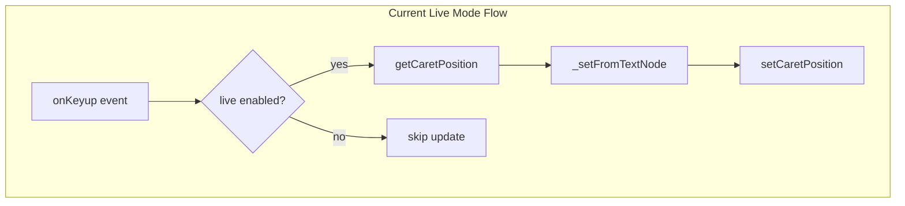

# Live Mode Feature Investigation

## Background

The `live` property in [IoString](packages/inputs/src/elements/IoString.ts) and [IoNumber](packages/inputs/src/elements/IoNumber.ts) enables real-time value updates on every keystroke. This requires `getCaretPosition`/`setCaretPosition` to preserve cursor position across DOM updates.

Current usages:

- Search/filter inputs in [IoMenuTree](packages/menus/src/elements/IoMenuTree.ts), [IoMenuOptions](packages/menus/src/elements/IoMenuOptions.ts)
- Search input in [IoBreadcrumbs](packages/editors/src/elements/IoBreadcrumbs.ts)
- Live label editing in [IoTab](packages/layout/src/elements/IoTab.ts)

## Investigation Tasks

### 1. Build Test Harness

Create comprehensive tests for live mode behavior:

- Verify caret position preservation during typing
- Test edge cases: empty string, cursor at start/middle/end
- Test rapid typing scenarios
- Test with special characters and unicode

### 2. Audit Caret Position Methods

Document all usages of `getCaretPosition`/`setCaretPosition`:

- Live mode preservation (IoString, IoNumber)
- Programmatic focus (onPointerup)
- Ladder interactions (IoNumberLadderSingleton)

Determine which usages are essential vs could be eliminated.

### 3. Explore Alternatives

**Alternative A: Native `<input>` element**

- Create `IoInputString` using native `<input type="text">`
- Compare behavior, styling constraints, accessibility
- Evaluate if contentEditable is necessary for IoString

**Alternative B: Event-based approach**

- Remove `live` property, rely on `value-input` event
- Consumers handle debouncing/throttling externally
- Less magic, more explicit

**Alternative C: Hybrid approach**

- Keep contentEditable for rich cases (IoNumber ladder, validation display)
- Use native input for simple live text inputs

### 4. Document Findings

- Why contentEditable was chosen over native input
- Tradeoffs of each alternative
- Recommendation for path forward

## Key Files

| File | Role |

|------|------|

| [IoField.ts](packages/inputs/src/elements/IoField.ts) | Base class with caret methods |

| [IoString.ts](packages/inputs/src/elements/IoString.ts) | String input with live mode |

| [IoNumber.ts](packages/inputs/src/elements/IoNumber.ts) | Number input with live mode |

| [IoElement.ts](packages/core/src/elements/IoElement.ts) | `_flattenTextNode` helper |

## Questions to Answer

1. Why was contentEditable chosen over native `<input>`?
2. Can `setCaretPosition` be eliminated if live mode is removed?
3. What breaks if consumers use `value-input` event instead of `live` property?
4. Are there accessibility implications of each approach?