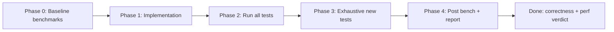
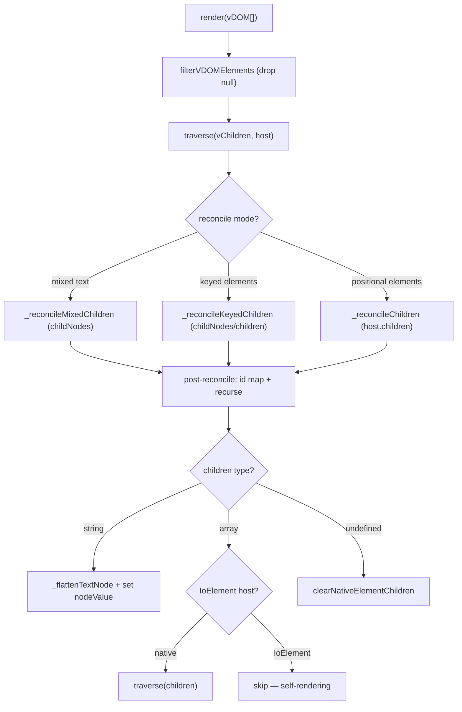

# Mixed Text + Element vDOM + Keyed Reconciliation

## Implementation Order

**Benchmark baseline → implement → exhaustive tests → post-implementation bench report.**

Nothing in the feature implementation starts until Phase 0 baseline benchmarks are committed and saved.



---

## Current Architecture

Io-Gui has no `h()` helper. vDOM is plain objects plus tag factories (`div`, `p`, `todoApp`):

```5:9:packages/core/src/vdom/VDOM.ts
export type VDOMElement = {
  tag: string
  props?: Record<string, any>
  children?: Array<VDOMElement | null> | string
}
```

**Render pipeline** (`IoElement.render` → `traverse` → `_reconcileChildren`):



**Existing infra:**

| Tool | Location | Notes |
|------|----------|-------|
| Vitest bench | `pnpm bench` | `--compare ./benchmarks/results.json --outputJson ./benchmarks/results.json` |
| Node benches | [`IoElement.bench.ts`](packages/core/src/elements/IoElement.bench.ts), [`VDOM.bench.ts`](packages/core/src/vdom/VDOM.bench.ts) | Minimal today; keyed benches exist but keys not yet functional |
| Browser benches | [`IoElement.browser.bench.ts`](packages/core/src/elements/IoElement.browser.bench.ts) | Real Chromium DOM |
| Results viewer | [`IoBenchmarksDemo.ts`](packages/core/src/demos/benchmarks/IoBenchmarksDemo.ts) | Reads `benchmarks/results.json` |

**Key constraints today:**

| Layer | Behavior |
|-------|----------|
| Type | `children` is **either** a single `string` **or** an array of `VDOMElement \| null` — never mixed |
| Reconciliation | Positional + tag match via `host.children`; **keys ignored** despite JSDoc claim |
| Key storage | `props.key` → `_vdomKey` on DOM via [`constructElement`](packages/core/src/vdom/VDOM.ts) — stored but never read during reconcile |
| Text optimization | `_flattenTextNode` collapses all content into one `#text` node — only for `children: string` |

---

## Phase 0 — Baseline Benchmarks (before any implementation)

Expand [`packages/core/src/vdom/Reconcile.bench.ts`](packages/core/src/vdom/Reconcile.bench.ts) (new) and update existing bench files. Cover **every reconciliation path** at realistic scales.

### Benchmark matrix

| Group | Scenario | Sizes | Purpose |
|-------|----------|-------|---------|
| **Positional (regression guard)** | Initial render N divs | 50, 200, 1000 | Baseline for unchanged fast path |
| | Re-render 0 / 1 / 10 / 50% prop changes | 200 | Update-in-place cost |
| | Shrink / grow list | 200 → 100 → 200 | Positional add/remove |
| | Nested tree depth 5 × breadth 10 | fixed | Deep recurse cost |
| **Keyed** | Initial render N keyed divs | 50, 200, 1000 | Key map build cost |
| | Re-render 0 changes (stable order) | 200 | No-op keyed pass |
| | Re-render 10 / 50% prop changes | 200 | Keyed update cost |
| | Full reorder (reverse) | 200, 1000 | `insertBefore` reorder cost |
| | Rotate by 1 | 200 | Common list shift |
| | Insert at head / middle / tail | 200 | Partial reorder |
| | Delete 1 / delete 50% | 200 | Orphan disposal |
| | Filter 50% (TodoList-like) | 500 | Keyed retain + dispose |
| **Mixed text** | `p(['text ', a(), ' more'])` × N paragraphs | 50, 200 | childNodes positional |
| | Re-render text-only change | 200 | Text nodeValue update |
| | Re-render element prop change | 200 | Element reuse in mixed |
| | Adjacent strings `['a','b',el]` | 200 | Multi text node cost |
| **Mixed + keyed** | `['Label: ', span({key})]` × N | 200 | Combined path |
| | Keyed span reorder with static text prefix | 200 | Text positional + keyed element |
| **Mode detection** | Element-only array (no keys, no text) | 200 | `.some()` overhead vs old path |
| **Widget pattern** | Cached children array, new wrapper each render | 200 × 10 renders | Existing reuse pattern from VDOM tests |
| **IoElement children** | N self-rendering IoElement widgets keyed | 50, 200 | Parent keyed reconcile only |

Run in **both** environments:
- Node + mock DOM ([`bench-setup.ts`](packages/core/src/testing/bench-setup.ts)) — fast CI signal
- Browser ([`IoElement.browser.bench.ts`](packages/core/src/elements/IoElement.browser.bench.ts)) — real layout/DOM cost

### Baseline capture procedure

```bash
# 1. Run full bench suite, save as immutable baseline
pnpm bench packages/core --outputJson ./benchmarks/results-baseline-vdom.json

# 2. Copy baseline into compare slot for post-implementation diff
cp benchmarks/results-baseline-vdom.json benchmarks/results.json
```

Store `results-baseline-vdom.json` in repo (or CI artifact) — this is the **before** snapshot. Do not overwrite it after implementation.

---

## Phase 1 — Implementation

### 1. Extend types — [`VDOM.ts`](packages/core/src/vdom/VDOM.ts)

```typescript
export type VDOMChild = VDOMElement | string | null

export type VDOMElement = {
  tag: string
  props?: Record<string, any>
  children?: Array<VDOMChild> | string
}
```

Helpers: `isVDOMElement`, `filterVDOMChildren`, `hasVDOMText`, `hasVDOMKeys`.

### 2. Keyed reconciliation — [`IoElement.ts`](packages/core/src/elements/IoElement.ts)

**Activate** when `hasVDOMKeys(vChildren)`.

`_reconcileKeyedChildren(vChildren, host, noDispose?)`:

1. Index `host.childNodes` → `Map<key, Element>` + unkeyed pool
2. Walk `vChildren` in order: text → Text node; keyed element → key lookup + tag check; unkeyed → positional fallback
3. Dispose orphan keyed nodes
4. Reorder via `insertBefore` without recreating matched nodes

### 3. Mixed reconciliation — [`IoElement.ts`](packages/core/src/elements/IoElement.ts)

When `hasVDOMText` and not `hasVDOMKeys`: `_reconcileMixedChildren` — positional `childNodes` diff.

When both text and keys: `_reconcileKeyedChildren` (unified).

Mode branch in `traverse` + top-level reconcile. IoElement hosts still skip parent traversal.

### 4. Factory overload types — [`IoNative.ts`](packages/core/src/elements/IoNative.ts), [`IoElement.ts`](packages/core/src/elements/IoElement.ts)

### 5. Demo — [`TodoApp.ts`](packages/core/src/demos/todomvc/TodoApp.ts), [`TodoList.ts`](packages/core/src/demos/todomvc/TodoList.ts)

---

## Phase 2 — Regression gate

All existing tests must pass unchanged:

- [`VDOM.test.ts`](packages/core/src/vdom/VDOM.test.ts) — full suite (element reuse, widget pattern, IoElement self-rendering, clear-children)
- [`IoElement.test.ts`](packages/core/src/elements/IoElement.test.ts) — render, keyed, dispose

```bash
pnpm test:core
```

---

## Phase 3 — Exhaustive Correctness Tests

New file: [`packages/core/src/vdom/Reconcile.test.ts`](packages/core/src/vdom/Reconcile.test.ts) — dedicated reconcile test matrix. Supplement existing files; don't dilute VDOM.test.ts further.

### Test matrix (every cell = at least one test)

| Mode | Operation | Assert |
|------|-----------|--------|
| Positional | initial render | DOM structure, textContent |
| Positional | prop update same tag | same node instance, updated props |
| Positional | tag change at index | new instance, old disposed |
| Positional | shrink / grow | correct count, trailing disposed |
| Positional | `children: string` → array | text flattened away |
| Positional | array → `undefined` | `clearNativeElementChildren` |
| Keyed | stable re-render | same instances |
| Keyed | reverse order | same instances, new `children` order |
| Keyed | insert head/mid/tail | existing preserved, one new instance |
| Keyed | delete one / many | removed disposed, rest preserved |
| Keyed | prop update | same instance |
| Keyed | tag change under key | old disposed, new created |
| Keyed | duplicate keys | `debug:` warn; deterministic survivor |
| Keyed | unkeyed sibling in keyed array | positional fallback works |
| Mixed | text + element structure | `childNodes` types correct |
| Mixed | text update re-render | same Text node, new value |
| Mixed | element update in mixed | element instance reused |
| Mixed | multiple adjacent strings | separate Text nodes |
| Mixed + keyed | text prefix + keyed element | text positional, element keyed reuse |
| Mixed + keyed | reorder keyed with static text | text stays, elements reorder |
| IoElement host | parent renders keyed IoElement | instance reused, internal children untouched |
| IoElement host | parent passes `children: []` | widget internal children preserved |
| `noDispose` | keyed reorder | nodes moved, not disposed |
| `noDispose` | mixed update | cached nodes retained |
| `props.id` / `this.$` | keyed reorder | `$` map points to moved nodes |
| EventDispatcher | keyed delete | listeners released on disposed subtree |
| Integration | TodoList filter route | todo item instances preserved when still visible |
| Integration | TodoList item removed | disposed item not in DOM |
| Null filtering | `[a, null, b]` | nulls dropped, structure correct |

### Test quality requirements

- Assert **node identity** (`toBe`) not just structure — reuse is the whole point
- Assert **disposal** where applicable (`_eventDispatcher` cleared, `dispose` called on IoElements)
- Use `nextQueue()` for async dispose paths
- Each test: minimal `@Register` host, append to `document.body`, `remove()` in cleanup
- No tests that only check `textContent` when instance reuse is the claim

---

## Phase 4 — Post-Implementation Benchmark Report

After implementation + all tests green:

```bash
# Compare against baseline saved in results.json (from Phase 0 copy)
pnpm bench packages/core --compare ./benchmarks/results.json --outputJson ./benchmarks/results-post-vdom.json
```

Generate [`benchmarks/vdom-reconcile-report.md`](benchmarks/vdom-reconcile-report.md):

| Section | Content |
|---------|---------|
| Summary | Overall verdict: pass / regress / improve |
| Regression guard | Positional-only benchmarks: max allowed **+5%** mean vs baseline; flag any exceedance |
| Keyed overhead | New keyed stable re-render vs positional stable — document absolute cost |
| Mixed overhead | Mixed render vs span-wrapped equivalent — document cost of native text nodes |
| Reorder cost | Keyed reverse 200 / 1000 — primary new workload metric |
| Browser vs Node | Side-by-side for top 10 scenarios |
| Per-benchmark table | name, baseline mean, post mean, delta %, within budget? |

**Regression budget (positional fast path):**

- Element-only, no keys, no text: **≤ 5% slower** mean at N=200
- Mode detection (`.some()`): **≤ 1% overhead** on element-only arrays
- If exceeded: optimize before merge (e.g. hoist mode flag, avoid allocation in `filterVDOMChildren`)

**Acceptance criteria for merge:**

1. All existing + new tests pass (`pnpm test:core`)
2. Positional regression guard benchmarks within budget
3. Keyed reorder benchmarks present and documented (no budget — new feature)
4. Report committed alongside code

---

## What This Deliberately Does NOT Include

- **`toVDOM` round-trip** for mixed/keyed content
- **Top-level `render(['text', div()])`**
- **Keyed text nodes** — strings always positional
- **Automatic perf CI gate** — report is manual review for now; can add threshold script later

---

## Risk / Edge Cases

- **Adjacent text nodes**: valid HTML; tested explicitly
- **`_flattenTextNode`**: sole `children: string` only; mixed/keyed bypass
- **`noDispose`**: keyed reorder must move not dispose
- **Bench env variance**: report includes RME from vitest; browser benches run 3× if high variance

## Unresolved Questions

- None.
