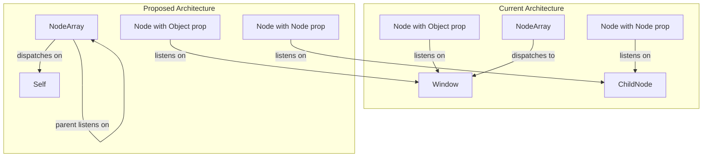
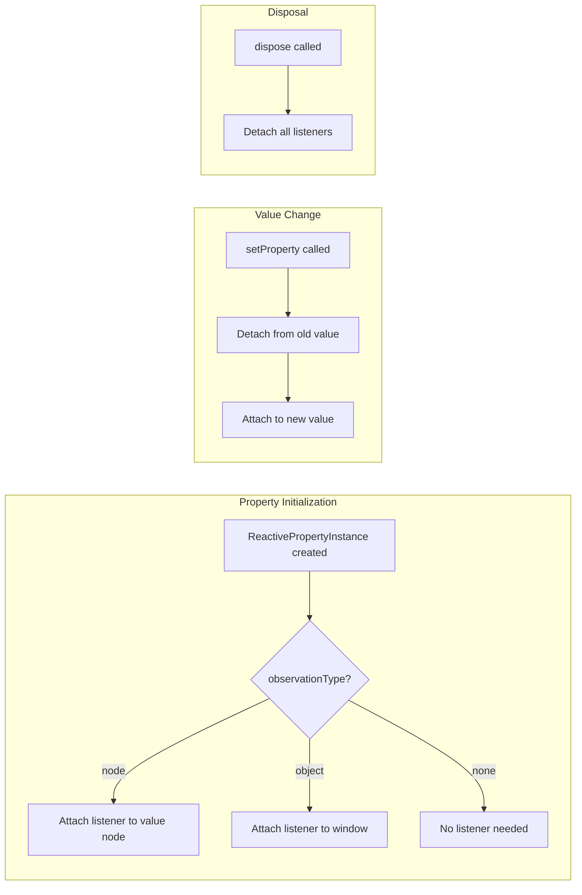

# Mutation Observation System Refactor

## Problem Analysis

The current mutation observation system has several issues:

1. **Two parallel observation systems** - `_observedObjectProperties` and `_observedNodeProperties` track the same concept (mutation observation) but with different listener targets
2. **Type flexibility creates edge cases** - Properties can switch between Node and Object values, causing observation state corruption (the bug we just fixed)
3. **Inconsistent dispatch patterns** - NodeArray dispatches to window despite containing Nodes
4. **Broken helper function** - `isNonNodeConstructor()` always returns false because everything inherits from Object



---

## Phase 1: Strict Property Type Enforcement

### Goal

Prevent type switching at runtime. If a property is typed as a Node subclass, it should only accept Node values.

### Changes

**[`packages/core/src/nodes/Node.ts`](packages/core/src/nodes/Node.ts)** - In `setProperty()`:

```typescript
// Add type validation before value assignment
if (prop.type) {
  const isNodeType = prop.type.prototype instanceof Node || prop.type.prototype._isNode
  const isValueNode = isNodeObject(value)
  
  if (isNodeType && !isValueNode && value !== null) {
    debug: console.error(`Property "${name}" expects Node type but received non-Node value`)
    return // Reject assignment
  }
  if (!isNodeType && isValueNode && prop.type !== Object) {
    debug: console.error(`Property "${name}" expects non-Node type but received Node value`)
    return // Reject assignment
  }
}
```


### Fix `isNonNodeConstructor()`

Current implementation is broken:

```typescript
function isNonNodeConstructor(type: AnyConstructor) {
  return !(type.prototype instanceof IoElement || type.prototype instanceof Object) // Always false!
}
```

Replace with:

```typescript
function isNodeConstructor(type: AnyConstructor): boolean {
  return type.prototype instanceof Node || type.prototype?._isNode === true
}
```

---

## Phase 2: Move Observation State to ReactivePropertyInstance

### Goal

Eliminate `_observedObjectProperties` and `_observedNodeProperties` Sets. Track observation state per-property.

### Changes

**[`packages/core/src/core/ReactiveProperty.ts`](packages/core/src/core/ReactiveProperty.ts)**:Add observation state to `ReactivePropertyInstance`:

```typescript
export class ReactivePropertyInstance {
  value?: any
  type?: AnyConstructor
  binding?: Binding
  reflect = false
  init?: any = undefined
  
  // New fields for observation
  readonly observationType: 'none' | 'node' | 'object'
  isObserving = false
}
```

Determine `observationType` at construction based on `type`:

- `type` extends Node → `'node'`
- `type` is Object/Array/other → `'object'`
- `type` is primitive (String/Number/Boolean) → `'none'`

**[`packages/core/src/nodes/Node.ts`](packages/core/src/nodes/Node.ts)**:Remove:

- `_observedObjectProperties: Set<string>`
- `_observedNodeProperties: Set<string>`
- `observeObjectProperty()` function
- `observeNodeProperty()` function

Add to `ReactivePropertyInstance`:

- `startObserving(node: Node)` - Attaches listener based on `observationType`
- `stopObserving(node: Node)` - Removes listener

Refactor `onPropertyMutated()`:

```typescript
export function onPropertyMutated(node: Node | IoElement, event: CustomEvent) {
  const object = event.detail.object
  let hasMutated = false
  
  node._reactiveProperties.forEach((prop, name) => {
    if (prop.isObserving && prop.value === object) {
      const handlerName = name + 'Mutated'
      if (typeof (node as any)[handlerName] === 'function') {
        (node as any)[handlerName](event)
      }
      hasMutated = true
    }
  })
  
  return hasMutated
}
```

---

## Phase 3: Unify NodeArray Dispatch Pattern

### Goal

Make NodeArray dispatch mutations on itself (like Nodes) rather than to window.

### Changes

**[`packages/core/src/core/NodeArray.ts`](packages/core/src/core/NodeArray.ts)**:

```typescript
// Change from window dispatch to self dispatch
dispatchMutation() {
  this.node.dispatch('io-object-mutation', {object: this.proxy})
}

itemMutated(event: CustomEvent) {
  this.node.dispatch('io-object-mutation', {object: this.proxy})
}
```

This means NodeArray will behave like a Node for observation purposes - parents will listen directly on the NodeArray instance.---

## Phase 4: Simplify Listener Management

### Goal

Centralize listener attachment/detachment logic.

### Architecture



**Window Listener Optimization**:Currently, the first object-typed property attaches a window listener. With property-level tracking:

```typescript
// In Node constructor, after property init
let hasObjectObservation = false
this._reactiveProperties.forEach(prop => {
  if (prop.observationType === 'object') hasObjectObservation = true
})
if (hasObjectObservation) {
  window.addEventListener('io-object-mutation', this.onPropertyMutated)
}
```

---

## Migration Path

1. **Phase 1** can be implemented immediately (adds strictness, fixes bug)
2. **Phase 2** is the largest change - refactors core observation model
3. **Phase 3** depends on Phase 2 (NodeArray uses new observation pattern)
4. **Phase 4** is cleanup/optimization after core changes

## Testing Strategy