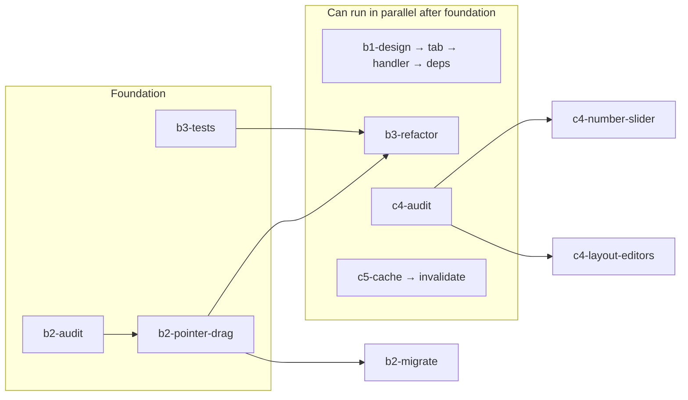
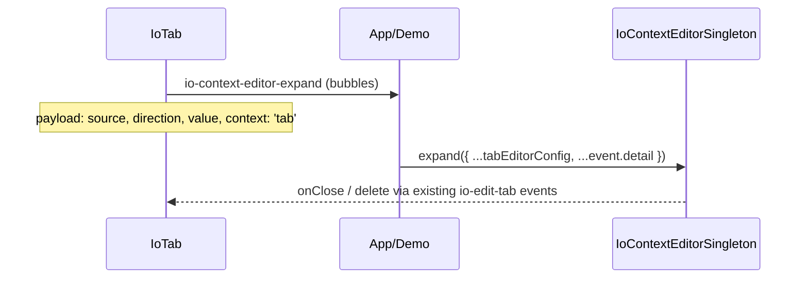

# Package Layer Improvements Plan

Parent roadmap item **package-layer** (B1–B3, C4–C5). Prerequisite work from the main roadmap is largely done: A1 node/element unification, C2 VDOM keyed diffing, E3 test safety net. This plan is the implementation breakdown.

## Dependency Graph



**Suggested order:** b2-audit → b2-pointer-drag → b3-tests → (B1 ∥ B3 ∥ c4-audit) → b2-migrate → c4-* → c5-* → b2-extras

---

## B1 — Break layout → editors dependency (P1)

### Problem

[`IoTab.ts`](packages/layout/src/elements/IoTab.ts) imports `IoContextEditorSingleton` from `@io-gui/editors` and calls it directly in `expandContextEditor()` (~L159–175). That inverts layering: a layout primitive pulls in the entire editors stack (property editors, editor configs, `ioString`, `ioButton`, icon option menus).

[`packages/layout/package.json`](packages/layout/package.json) lists `@io-gui/editors` as both **devDependency** and **peerDependency**, forcing every layout consumer to install editors even when tabs only need drag/reorder.

### Current coupling

```typescript
// IoTab.expandContextEditor() — layout knows editor widget types
IoContextEditorSingleton.expand({
  source: this,
  direction: 'down',
  value: this.tab,
  properties: ['label', 'icon'],
  config: [
    ['label', ioString({live: true})],
    ['icon', iconOptions],  // built from IconsetDB + ioOptionSelect
  ],
  widget: ioButton({label: 'Delete Tab', icon: 'io:close', action: deleteAction}),
})
```

Tab editing config (`ioString`, `iconOptions`, delete button) lives in layout but belongs in editors or the app shell.

### Target architecture



### Itemized TODOs

| ID | Task | Files | Notes |
|----|------|-------|-------|
| **b1-design** | Define `io-context-editor-expand` CustomEvent detail type | `packages/layout/src/elements/IoTab.ts`, optional `packages/core/src/types/` | Include `source`, `direction`, opaque `value` (Tab), and a `context` string (`'tab'`) so the handler can pick config. Delete action should stay as `io-edit-tab` dispatch, not editors import. |
| **b1-tab-refactor** | Replace singleton call with `this.dispatch('io-context-editor-expand', detail, true)` | `IoTab.ts` | Move `icons`/`iconOptions` construction out of layout. `expandContextEditor()` becomes ~5 lines. |
| **b1-wire-handler** | Register handler in demo/app entry | e.g. `packages/layout/src/demos/*` or root dev shell | Handler imports editors, builds tab config, calls `IoContextEditorSingleton.expand()`. Pattern mirrors existing `io-edit-tab` capture in [`IoTabsHamburgerMenuSingleton.ts`](packages/layout/src/elements/IoTabsHamburgerMenuSingleton.ts). |
| **b1-deps-tests** | Remove editors peer dep; fix tests | `package.json`, [`IoTab.test.ts`](packages/layout/src/elements/IoTab.test.ts) | Tests currently spy `expandContextEditor`; assert event dispatch instead. Verify `pnpm build` for layout without editors installed (optional CI matrix). |

### Acceptance criteria

- `@io-gui/layout` has zero runtime imports from `@io-gui/editors`
- Tab context-menu / Shift+Enter still opens editor when app wires handler
- Delete tab still works via `io-edit-tab` / existing panel handlers

### Open questions

- Should tab editor config live in `@io-gui/editors` (e.g. `expandTabContextEditor(tab, source)`) or stay in app demo code?
- Is a generic `io-context-editor-expand` event sufficient, or do we need a layout-specific `io-tab-edit` event with richer typing?

---

## B2 — Lift pointer-drag helper to core (P1)

### Problem

The capture → move → up/cancel pattern is duplicated across ~8+ elements with subtle differences:

| Element | Package | Pattern |
|---------|---------|---------|
| [`IoField`](packages/inputs/src/elements/IoField.ts) | inputs | capture + move/leave/up/cancel; sets `pressed` |
| [`IoString`](packages/inputs/src/elements/IoString.ts) | inputs | move/up only (no capture); focus/caret |
| [`IoNumberLadderStep`](packages/inputs/src/elements/IoNumberLadderStep.ts) | inputs | capture + move/up |
| [`IoSlider`](packages/sliders/src/elements/IoSlider.ts) | sliders | capture + move/up; caches `#rect`; touch scroll lock |
| [`IoSliderBase`](packages/sliders/src/elements/IoSliderBase.ts) | sliders | same as IoSlider (near duplicate) |
| [`IoDivider`](packages/layout/src/elements/IoDivider.ts) | layout | capture + move/up/cancel; dispatches custom events |
| [`IoTab`](packages/layout/src/elements/IoTab.ts) | layout | capture + move/up/cancel; forwards to `tabDragIconSingleton` |

`clamp()` is copy-pasted in both [`IoSlider.ts`](packages/sliders/src/elements/IoSlider.ts) and [`IoSliderBase.ts`](packages/sliders/src/elements/IoSliderBase.ts) (~L3–5).

Roadmap also mentions lifting `io-focus-to` keyboard nav, overlay singleton expand/nudge patterns, and loading-spinner CSS — treat as **b2-extras** after the drag helper lands.

### Proposed API (core)

Location: `packages/core/src/utils/PointerDrag.ts` (export from `@io-gui/core` index).

```typescript
type PointerDragOptions = {
  onStart?: (event: PointerEvent) => void
  onMove?: (event: PointerEvent) => void
  onEnd?: (event: PointerEvent) => void
  onCancel?: (event: PointerEvent) => void
  stopPropagation?: boolean
  preventDefault?: boolean | 'down' | 'move'
}

// Returns disposer for cleanup (disconnect, dispose)
function bindPointerDrag(host: HTMLElement, options: PointerDragOptions): () => void
```

Also export `clamp(num, min, max)` from `packages/core/src/utils/Math.ts` (handles inverted min/max like sliders).

Design constraints:

- Must support elements that **don't** use capture (IoString)
- Must support custom end handlers (IoDivider dispatches `io-divider-move-end`)
- Cleanup on `disconnectedCallback` / dispose — aligns with A4 leak fixes
- Do not force one-size-fits-all touch-scroll locking; keep that in slider-specific code

### Itemized TODOs

| ID | Task | Notes |
|----|------|-------|
| **b2-audit** | Document per-element deltas | Table above + note IoField `pointerleave` vs IoSlider omitting it |
| **b2-pointer-drag** | Implement `bindPointerDrag` + `clamp`; unit test in core | Test capture lifecycle, disposer, cancel path |
| **b2-migrate** | Replace boilerplate in listed elements | Do sliders last (after B3) to avoid double migration |
| **b2-extras** | Optional: shared `dispatchIoFocusTo`, `@keyframes io-loading-spinner` in theme/core | [`IoSelector.ts`](packages/navigation/src/elements/IoSelector.ts) vs [`IoMarkdown.ts`](packages/markdown/src/elements/IoMarkdown.ts) use different spinner names |

### Acceptance criteria

- No duplicated capture/move/up/remove blocks in migrated elements
- Single `clamp` implementation used by all sliders
- Existing pointer UX unchanged (manual QA on sliders, tab drag, divider resize)

---

## B3 — Fix IoSlider not extending IoSliderBase (P1)

### Problem

[`IoSlider`](packages/sliders/src/elements/IoSlider.ts) extends `IoGl` directly instead of [`IoSliderBase`](packages/sliders/src/elements/IoSliderBase.ts). Siblings [`IoSliderRange`](packages/sliders/src/elements/IoSliderRange.ts) and [`IoSlider2d`](packages/sliders/src/elements/IoSlider2d.ts) correctly extend `IoSliderBase`.

Duplicated between IoSlider and IoSliderBase (~200 lines):

- Identical `:host` CSS (IoSlider adds `[disabled]` opacity; Base adds `[invalid]` red styling)
- `clamp` helper
- Touch scroll-direction lock (`#active` / `_active` gate)
- Pointer handlers (`onPointerdown/move/up`, rect cache)
- Keyboard `io-focus-to` dispatch
- ARIA handlers (`valueChanged`, `minChanged`, etc.)

IoSlider-specific:

- Single `number` value (Base supports `number | [number, number]`)
- Custom GLSL `Frag` shader for 1D slider
- `disabled` reactive property + `inert`

### Refactor approach

1. **b3-tests first:** Snapshot or behavior tests for pointer value input, keyboard step, touch scroll lock, disabled state
2. `class IoSlider extends IoSliderBase`
3. Override only: `Style` (merge disabled + invalid), `Frag`, scalar `_inputValue` / `_getPointerCoord`, `disabledChanged`
4. Delete duplicated handlers from IoSlider; call `super` where needed
5. Align invalid styling — pick one visual (Base red fill vs Slider red border) or compose both

### Acceptance criteria

- IoSlider behavior identical in demos and editor configs
- IoSliderRange / IoSlider2d unaffected
- Line count of IoSlider.ts drops substantially

---

## C4 — Reduce full re-renders in composites (P1)

### Problem

Several composites rebuild entire VDOM subtrees on any property change via `changed() → render([...])`, even when child elements could receive prop updates directly (especially now that C2 keyed diff exists).

### Hot spots

| Component | File | Issue |
|-----------|------|-------|
| **IoNumberSlider** | [`IoNumberSlider.ts`](packages/sliders/src/elements/IoNumberSlider.ts) | `changed()` always `render([ioNumber, ioSlider])` (~L72–93). Value changes from slider/number re-create both children. |
| **IoNumberSliderRange** | [`IoNumberSliderRange.ts`](packages/sliders/src/elements/IoNumberSliderRange.ts) | Same pattern |
| **IoSplit** | [`IoSplit.ts`](packages/layout/src/elements/IoSplit.ts) | `changed()` rebuilds full split tree (~L382+). `splitMutated()` triggers on any split node mutation. |
| **IoTabDragIcon** | [`IoTabDragIcon.ts`](packages/layout/src/elements/IoTabDragIcon.ts) | `changed()` re-renders icon+label on every drop-target prop change during drag (~L192–202). |
| **IoPropertyEditor** | [`IoPropertyEditor.ts`](packages/editors/src/elements/IoPropertyEditor.ts) | Full rebuild in `configureDebounced()` on config/value changes; `changedThrottled()` only patches `_propertyEditors` values (~L269–276) — inconsistent paths. |
| **IoObject / IoInspector** | editors | Same composite pattern |

### Strategies (pick per component)

1. **Stable child refs:** `ready()` renders once; `valueChanged()` assigns `this.$['number'].value = ...` and `this.$['slider'].value = ...`
2. **Split handlers:** `dropTargetChanged()` updates singleton only; skip render unless `tab` or `dragging` changed
3. **IoSplit:** Render on structural changes (children add/remove, orientation); patch `flex` styles via property handlers on child vdom refs
4. **IoPropertyEditor:** Always use incremental path when `_propertyEditors` populated; full rebuild only when config/groups/properties list changes

### Itemized TODOs

| ID | Task | Priority |
|----|------|----------|
| **c4-audit** | List all `override changed()` that call `render` with static structure | P0 |
| **c4-number-slider** | IoNumberSlider + IoNumberSliderRange incremental bind | P0 — high traffic in editors/three |
| **c4-layout-editors** | IoSplit, IoTabDragIcon, IoPropertyEditor/IoObject | P1 |

### Acceptance criteria

- Profiling: no full VDOM rebuild on single `value` tick in IoNumberSlider
- Tab drag: `detectDropTargets` property churn does not re-render label/icon unless `tab` changed
- Inspector editing: mutating one property does not rebuild unrelated editor rows

### Dependency

C2 keyed diff helps but does not eliminate allocation churn from `render([...])` calls — C4 is still needed.

---

## C5 — Tab-drag spatial cache (P1)

### Problem

[`IoTabDragIcon.detectDropTargets()`](packages/layout/src/elements/IoTabDragIcon.ts) (~L96–150) runs on **every pointermove** after drag threshold:

```typescript
root.querySelectorAll('io-tabs')   // + getBoundingClientRect per container
tabsContainer.querySelectorAll('io-tab')  // + getBoundingClientRect per tab
root.querySelectorAll('io-panel')  // + getBoundingClientRect per panel
```

On large layouts this is O(panels + tabs) DOM queries + layout reads per frame.

### Proposed cache

Build once when drag starts (`dragging` flips true in `updateDrag`):

```typescript
type TabBarCache = {
  panel: IoPanel
  tabsRect: DOMRect
  tabs: { element: Element; rect: DOMRect }[]
}
type DragSpatialCache = {
  tabBars: TabBarCache[]
  panels: { panel: IoPanel; rect: DOMRect }[]
  spacing: number
}
```

- **Hit test** uses cached rects + pointer coords (same logic as today)
- **Invalidate** cache when: window resize/scroll, split mutation during drag, or explicit `root.invalidateLayout()` hook
- Optional: cache survives entire drag session; rebuild only on invalidation

### Itemized TODOs

| ID | Task |
|----|------|
| **c5-cache** | Add `_spatialCache: DragSpatialCache \| null`; populate in `updateDrag` when entering drag mode |
| **c5-invalidate** | Listen `resize`/`scroll` on window; listen split layout events if available; null cache |

### Tests

Extend [`IoTab.test.ts`](packages/layout/src/elements/IoTab.test.ts) or add `IoTabDragIcon.test.ts`:

- Mock `getBoundingClientRect`; assert querySelectorAll called once per drag, not per move
- Drop index still correct at tab bar edges and panel split zones

### Acceptance criteria

- `querySelectorAll` count per drag session = O(1), not O(pointermove events)
- Drop behavior unchanged (manual QA: reorder tabs, split panel drops)

---

## Cross-cutting test plan

| Area | Command | Coverage |
|------|---------|----------|
| B1 | `pnpm test:layout` | IoTab context menu dispatches event |
| B2 | `pnpm test:core` | PointerDrag unit tests |
| B3 | `pnpm test:sliders` | IoSlider pointer/keyboard regression |
| C4 | `pnpm test:sliders` + `pnpm test:editors` | Incremental update behavior |
| C5 | `pnpm test:layout` | Spatial cache call counts |

Run `pnpm test` before merging the full package-layer milestone.

---

## Unresolved questions

1. **B1:** Tab editor config in editors package vs app shell — who owns the icon picker options list?
2. **B2:** Single `bindPointerDrag` vs layered helpers (capture vs no-capture presets)?
3. **B3:** Invalid/disabled styling merge — keep Base red fill, Slider red border, or unify?
4. **C4:** IoSplit partial update scope — patch flex only, or defer until a dedicated Split render pass?
5. **C5:** Should spatial cache live on `tabDragIconSingleton` or a small `TabDragSpatialIndex` node class?
