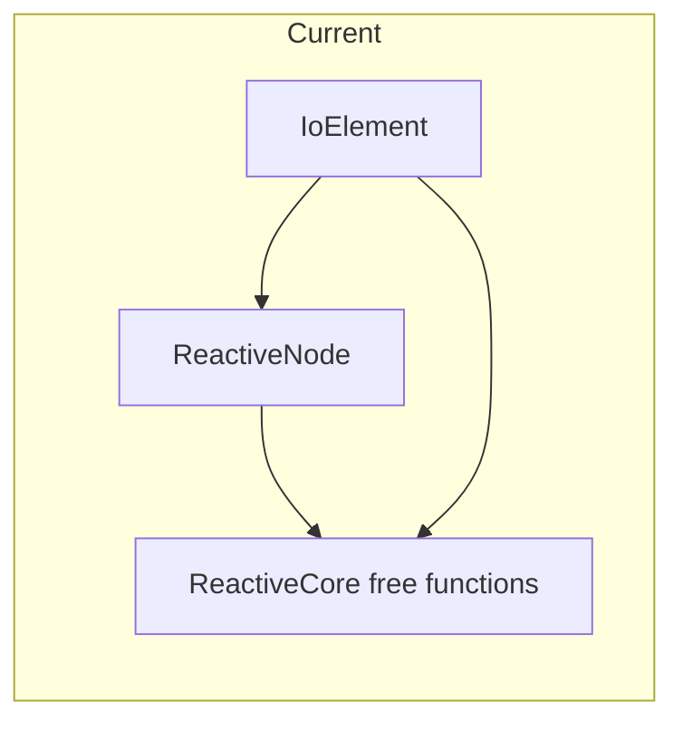
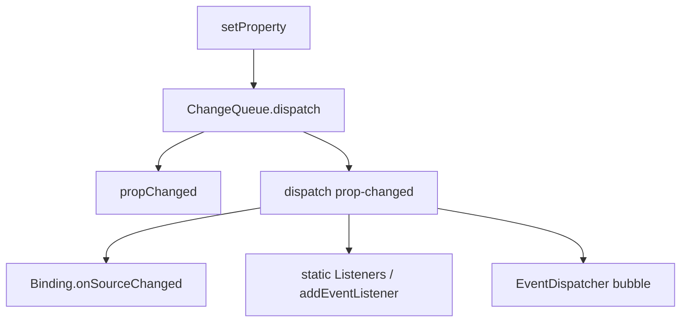

# Principles Reconsideration Evaluation Plan

Evaluate six architectural principles from the design review. **Goal:** decision record per principle (Keep / Modify / Demote / Abandon) with evidence — not implementation yet.

**Already addressed elsewhere (baseline, not in scope):**
- ReactiveCore + unified parent graph ([packages/core/src/core/ReactiveCore.ts](packages/core/src/core/ReactiveCore.ts)) — original concern #1 largely mitigated
- One window mutation listener per node ([packages/core/src/core/ReactiveProperty.ts](packages/core/src/core/ReactiveProperty.ts) `ensureWindowMutationListener`)
- VDOM keys — done in original roadmap
- Packaging: `exports` → dist, narrowed `sideEffects`, incremental `tsc -b` ([packages/core/package.json](packages/core/package.json))
- Package-layer refactors → [package_layer.plan.md](.cursor/plans/package_layer.plan.md)
- Three config lazy-loading → [three.js_ui_configs.plan.md](.cursor/plans/three.js_ui_configs.plan.md)

**Principles to affirm (no evaluation needed):** domain models separate from views, zero runtime deps, `debug:` blocks, convention-based handlers — document as non-negotiables in the decision doc intro.

---

## Shared evaluation framework

For each principle, produce a short **Decision Record** (ADR-style) with:

| Criterion | Question |
|-----------|----------|
| **Correctness** | Does the principle hold under edge cases (dispose, shared values, DOM boundaries)? |
| **Performance** | Measurable hot-path cost? (allocations, listener count, dispatch depth) |
| **DX / API** | Does it match how apps actually use Io-Gui? |
| **Complexity budget** | Lines + concepts vs benefit (e.g. `hasVisitedDomAncestor`, window mutation bus) |
| **Migration cost** | Breaking changes, test churn, docs |
| **Alternatives** | What replaces it if modified/abandoned? |

**Deliverable:** `.cursor/plans/principles-decisions.md` (or `docs/architecture/principles.md`) with 6 sections + final summary table.

**Evidence methods:**
- Static audit (grep, call-graph notes)
- Micro-benchmarks in Vitest (optional, for principles 2 and 5)
- Usage inventory (production packages only, exclude `*.test.ts` and `demos/`)

---

## Principle 1: Universal reactivity via parallel base classes

**Current state:** [ReactiveCore.ts](packages/core/src/core/ReactiveCore.ts) shares internals; [ReactiveNode.ts](packages/core/src/nodes/ReactiveNode.ts) and [IoElement.ts](packages/core/src/elements/IoElement.ts) still duplicate instance API (~150+ lines each: `setProperty`, `dispatch`, bindings, queue).

**Evaluation tasks:**
- Diff RN vs IE public/instance methods; list remaining duplication and intentional divergences (VDOM, ResizeObserver, `connectedCallback`)
- Check circular import RN ↔ IE — is it a long-term liability?
- Survey subclass patterns: do apps extend RN, IE, or both?

**Decision options:**
- **Keep:** shared free functions + two bases (status quo, document contract)
- **Modify:** extract `ReactiveOwner` mixin/abstract layer for shared methods; IE extends HTMLElement + mixin
- **Abandon dual-class goal:** not recommended — conflicts with CE + node model split

---

## Principle 2: Events as internal reactivity transport

**Current state:** Every property change → handler → `dispatch('[prop]-changed')` ([ChangeQueue.ts](packages/core/src/core/ChangeQueue.ts) ~L125–138). [Binding.ts](packages/core/src/core/Binding.ts) listens to `-changed` events for sync. Internal and public consumers share one path.

**Evaluation tasks:**
- Inventory `-changed` listeners: Binding vs app `Listeners` vs imperative `addEventListener`
- Count allocations per `setProperty` (Change object, event name string, CustomEvent/synthetic payload)
- Identify cases where handler + event duplicate work (same node, same tick)
- Prototype design sketch: **internal subscribers** (Binding, coalesced batch) vs **public events** (opt-in dispatch when listeners exist)

**Decision options:**
- **Keep:** single event path — simplicity, one mental model
- **Modify (recommended candidate):** fast path for `*Changed` handlers + Binding; events only when listeners registered or `bubbles: true`
- **Abandon events for property changes:** replace with signals — high migration cost, conflicts with DOM event interop

---

## Principle 3: Synthetic bubbling through `_parents`

**Current state:** [EventDispatcher.dispatchEvent](packages/core/src/core/EventDispatcher.ts) walks `_parents` for non-DOM nodes (~L367–372). DOM elements rely on native bubbling + `hasVisitedDomAncestor` dedup (~L77–85). Production `dispatch(..., true)` usage is mostly **IoElement → DOM tree** (layout, inputs, menus, three).

**Evaluation tasks:**
- Classify all `dispatch(..., true)` call sites: node-graph bubble vs DOM-only vs both
- Find node-only graphs that rely on `_parents` bubbling (exclude EventDispatcher tests)
- Measure complexity: `hasVisitedDomAncestor`, `_parents`/`_children` maintenance, dispose cleanup
- Compare alternative: explicit `parent.addEventListener` / Binding / callback injection for the N real cross-node cases

**Decision options:**
- **Keep:** synthetic bubble as core guarantee for node graphs
- **Modify:** default `bubbles: false` for node dispatch; bubble opt-in per event name
- **Demote:** node graphs use explicit subscription; keep DOM bubbling only — remove or simplify `_parents` walk

---

## Principle 4: Automatic observation of plain objects

**Current state:** `type: Object` props use window `io-object-mutation` bus (one listener per node, improved). Io values listen directly; `NodeArray` uses proxy + self-listener. `Color` in-place mutation still invisible ([packages/core/src/core/Color.ts](packages/core/src/core/Color.ts)).

**Production `type: Object` usage:** layout (`IoSplit`, `IoPanel`, `IoDrawer`), editors (`IoInspector`, `IoObject`, `IoPropertyEditor`), three (`IoVectorBase`, `IoBuildGeometry`).

**Evaluation tasks:**
- For each production `type: Object` prop: is value mutated in place, replaced, or wrapped in Node/NodeArray?
- Count `dispatchMutation` calls outside core — do apps use explicit mutation today?
- Document failure modes: shared plain objects, array mutation without proxy, `Color.r =`
- Compare alternatives:
  - **A:** explicit only — plain objects require `dispatchMutation` or replacement
  - **B:** proxy wrapper at assignment boundary (one-time wrap)
  - **C:** keep window bus, document limits

**Decision options:**
- **Keep:** automatic observation via window bus
- **Modify:** require `NodeArray` or Io types for collections; plain objects replace-only unless `dispatchMutation`
- **Abandon auto-observation for plain objects:** explicit mutation signaling (simplest mental model)

---

## Principle 5: Per-node `reactivity` timing mode

**Current state:** `reactivity: 'immediate' | 'throttled' | 'debounced'` on every owner ([ReactiveNode.ts](packages/core/src/nodes/ReactiveNode.ts) `dispatchQueue` ~L445–450). Default applied via reactive property definition.

**Evaluation tasks:**
- Grep production (non-test) assignments/overrides of `reactivity` — likely near-zero outside Theme/Storage patterns
- Map which nodes use `debounced`/`throttled` implicitly via class defaults
- Identify footguns: composing nodes with different modes; Binding bypassing `setProperty` debounce flags
- Compare: global rAF batch (default) + `@immediate` property decorator or per-call `setProperty(..., {sync: true})`

**Decision options:**
- **Keep:** per-node mode for Theme, Storage, heavy inspectors
- **Modify:** global default rAF batch; node mode deprecated to explicit per-write flag
- **Abandon node-wide mode:** single scheduler — document migration from `reactivity` property

---

## Principle 6: Framework vs library identity

**Current state:** Packages describe themselves as "library" ([packages/core/package.json](packages/core/package.json)); registration still side-effectful (`sideEffects: ["**/elements/**", "**/nodes/**"]`). `@io-gui/three` config registration moving to lazy plan.

**Evaluation tasks:**
- Audit registration side effects per package: `@Register`, singleton module init, config `registerEditorConfig`
- Tree-shake test: import single symbol from `@io-gui/inputs` — what still loads?
- Define two explicit product modes:
  - **Library:** granular imports, minimal side effects, consumer calls `registerIoGui()` or imports elements explicitly
  - **Framework:** meta-package or app template, full registration, batteries included
- Align with publish story: dist bundles vs granular packages

**Decision options:**
- **Library-first:** narrow sideEffects to entry/register modules; lazy CE registration API
- **Framework-first:** embrace full import side effects; document "import package = register all"
- **Hybrid (likely):** core + inputs as library; editors/three as opt-in framework layers

---

## Implementation phasing (after evaluation only)

Do **not** start refactors until all six decision records exist.

| Phase | Trigger | Action |
|-------|---------|--------|
| **Phase 0** | This plan | Audits + decision doc |
| **Phase 1** | Low-cost + high-confidence decisions | e.g. document Color replace-only; default `bubbles: false` for nodes if evidence supports |
| **Phase 2** | Decisions with perf proof | e.g. Binding fast-path if benchmarks justify |
| **Phase 3** | Breaking changes | e.g. remove synthetic bubble, drop `reactivity` property |

Cross-links: perf work stays in package_layer plan; three lazy configs in three.js_ui_configs plan.

---

## Unresolved questions

- Should evaluation include **Vitest micro-benchmarks** for principles 2 and 5, or static audit only?
- For principle 6, which product mode is the **primary audience** today (internal demos vs npm consumers)?
- After decisions, should breaking changes target **3.0** or stay in 2.x alpha?
