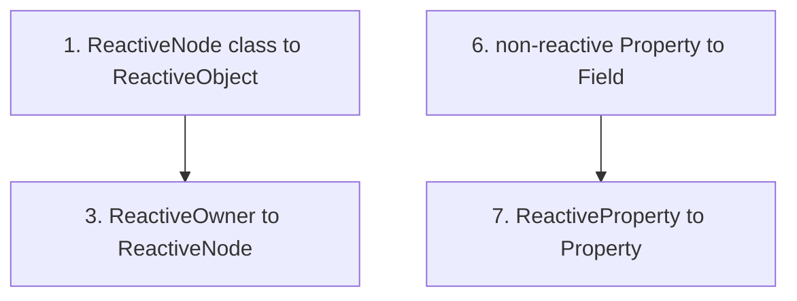

# Reactive Rename Codemod

Apply the four ADRs' renames as ordered, individually-verifiable codemods across `packages/*/src` only (`dist/` is build output, regenerated by `tsc -b` — never edit it). Pre-released framework, so breaking changes are fine.

## Verification after every todo

Run both, in order, and only proceed when green:

- `pnpm build` — this is `eslint --fix && clean && tsc -b`, so it typechecks all packages (catches missed references that tests alone would not).
- `pnpm test` — `vitest run --project unit` (runs from source; no prebuild needed).

If Playwright complains: `source .env && pnpm test 2>&1`, else `pnpm exec playwright install chromium`.

## Ordering rationale (collisions)

Two pairs must be sequenced or the new name collides with a still-existing old name:

- Free the name `ReactiveNode` (rename the class to `ReactiveObject`) **before** repurposing it for the union (`ReactiveOwner`→`ReactiveNode`).
- Move the non-reactive `Property` family out to `Field` **before** promoting `ReactiveProperty`→`Property`.

## Substring traps (do NOT blind find-replace)

- `Property`/`Properties` is a substring of `ReactiveProperty`/`ReactiveProperties`. In todo 6 use negative lookbehind: `(?<!Reactive)\bPropert(y|ies)\b`.
- `changed` appears in event strings (`'value-changed'`) and `[prop]Changed` handlers. In todo 8 only target the bare method: `.changed(` / `changed()` declarations and the call site, never `\bchanged\b` globally.
- Use `\bReactiveElement\b` (word boundary) so `ReactiveElementInspectorDemo` etc. are untouched.

## Key files

- [packages/core/src/core/ReactiveCore.ts](packages/core/src/core/ReactiveCore.ts) — `ReactiveOwner`, `isReactiveOwner`, `isIoValue` alias, `initReactiveOwnerInternals`, flag predicate.
- [packages/core/src/nodes/ReactiveNode.ts](packages/core/src/nodes/ReactiveNode.ts) — base class, `changed()`, `initProperties`/`initReactiveProperties`, flags.
- [packages/core/src/elements/ReactiveElement.ts](packages/core/src/elements/ReactiveElement.ts) — element base, `_isReactiveElement`.
- [packages/core/src/decorators/Property.ts](packages/core/src/decorators/Property.ts) — `Property`/`ReactiveProperty` decorators, `propertyDecorators`/`reactivePropertyDecorators`.
- [packages/core/src/core/ProtoChain.ts](packages/core/src/core/ProtoChain.ts) — `reactiveProperties`, `addReactiveProperties*`.
- [packages/core/src/core/ReactiveProperty.ts](packages/core/src/core/ReactiveProperty.ts) — `ReactivePropertyInstance`, `ReactiveProtoProperty`, `ReactivePropertyDefinition*`.
- [packages/core/src/core/ChangeQueue.ts](packages/core/src/core/ChangeQueue.ts) — `#invokeChanged` → `this.node.changed()` call site.
- [packages/core/src/vdom/VDOM.ts](packages/core/src/vdom/VDOM.ts) — `_isReactiveElement` check.

## Magnitude (src only, approx)

`ReactiveProperty*`/`ReactiveProperties` and `ReactiveElement` each appear in essentially every component file across all 11 packages (hundreds of refs); `ReactiveNode` ~250 refs; flags/`isIoValue` concentrated in core. Each codemod is global; expect large but mechanical diffs.

## Notes

- Each todo includes renaming the corresponding file(s) and all imports in the same atomic pass so the build stays green between todos.
- Concrete element subclasses keep their `Io` prefix (`IoButton`, `IoTab`, …); only the base `ReactiveElement` becomes `ReactiveElement`.
- Suggested flag names: `_isNode`→`_isReactiveObject`, `_isReactiveElement`→`_isReactiveElement`; internal map `_reactiveProperties`→`_properties`.
- Final todo updates human/agent docs so they stop teaching deprecated names: [packages/core/README.md](packages/core/README.md) and [.cursor/rules/io-gui.mdc](.cursor/rules/io-gui.mdc).
