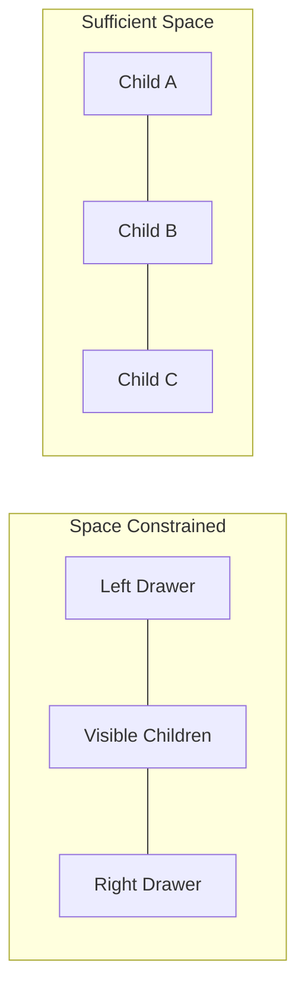

# Simplified Responsive Drawer Collapse

## Core Approach

Each IoSplit manages its own left/right (horizontal) or top/bottom (vertical) drawers. When container size drops below threshold, edge children collapse to drawers. This is **view-only logic** - no changes to Split/Panel models.



## Collapse Rules

**3+ children**: Simple - leftmost to left drawer, rightmost to right drawer

**2 children priority** (only one collapses):

1. Fixed size child → drawer (auto-sized stays visible)
2. Both fixed → smaller one to drawer
3. Both auto → right child to drawer

## Key Implementation Details

### MinSize Calculation

Compute effective minSize for each child:

- Fixed size children: use their `size` value as minSize
- Auto-sized children: use default minSize (e.g., `ThemeSingleton.fieldHeight * 4`)

### Collapse Detection in [`packages/layout/src/elements/IoSplit.ts`](packages/layout/src/elements/IoSplit.ts) - IMPLEMENTED

Uses `onResized()` hook from IoElement's built-in ResizeObserver:

```typescript
// Collapse state properties (orientation-agnostic naming)
@ReactiveProperty({type: Object, value: null})
declare leadingDrawer: Split | Panel | null

@ReactiveProperty({type: Object, value: null})
declare trailingDrawer: Split | Panel | null
```

### Collapse Algorithm - IMPLEMENTED

`calculateCollapsedDrawersDebounced()` implements:

1. Get container size based on orientation
2. Sum minSize (300 for auto, actual size for fixed)
3. Determine `collapsePriority` for 2-child case
4. If `size < minSize`: collapse based on priority rules

## Bug Fixes Needed

### Bug 1: Line 102 - Wrong index in noneAuto comparison

```typescript
// Current (wrong):
collapsePriority = children[0].size <= children[1].size ? 'start' : 'end'
// Should be:
collapsePriority = children[0].size <= children[children.length - 1].size ? 'start' : 'end'
```

### Bug 2: Divider index mismatch when drawers collapsed

Dividers rendered with original array index `i`, but `onDividerMove` iterates DOM children expecting consecutive indices. When leading child is collapsed, indices don't align → wrong children get resized.

**Fix**: Track visible child offset and adjust divider indices, or store offset in divider and account for it in handlers.

### Bug 3: No initial collapse calculation

`calculateCollapsedDrawersDebounced()` only called on resize/divider-move-end. Should trigger on initial render.

**Fix**: Call from `changed()` or add `splitChanged()` handler

### New Elements

**IoDrawer** - Slide-out container at split edge

- Props: `edge: 'left'|'right'|'top'|'bottom'`, `open: boolean`, `child: Split|Panel`
- Renders full child structure (IoPanel or nested IoSplit)
- CSS: absolutely positioned, transforms in/out

**IoDrawerHandle** - Toggle button at edge

- Shows icon indicating collapsed content
- Click toggles drawer open/closed
- Positioned at edge of IoSplit

### IoSplit.changed() Modification - PARTIALLY IMPLEMENTED

Current implementation skips collapsed children in render loop. Next step: add drawer elements.

```typescript
changed() {
  const vChildren: VDOMElement[] = []
  const edge = this.split.orientation === 'horizontal' ? ['left', 'right'] : ['top', 'bottom']
  
  // Leading drawer handle + drawer
  if (this.leadingDrawer) {
    vChildren.push(ioDrawerHandle({edge: edge[0], ...}))
    vChildren.push(ioDrawer({edge: edge[0], child: this.leadingDrawer, ...}))
  }
  
  // Visible children with adjusted divider indices
  let visibleIndex = 0
  for (let i = 0; i < this.split.children.length; i++) {
    if (i === 0 && this.leadingDrawer) continue
    if (i === lastIndex && this.trailingDrawer) continue
    // render child...
    // divider with index: visibleIndex (not i)
    visibleIndex++
  }
  
  // Trailing drawer handle + drawer
  if (this.trailingDrawer) {
    vChildren.push(ioDrawerHandle({edge: edge[1], ...}))
    vChildren.push(ioDrawer({edge: edge[1], child: this.trailingDrawer, ...}))
  }
}
```

### Drag-Drop Support

Modify [`packages/layout/src/elements/IoTabDragIcon.ts`](packages/layout/src/elements/IoTabDragIcon.ts):

- `detectDropTargets` should include panels inside drawers
- When tab dropped from drawer panel to main layout, it works naturally
- When last tab removed from drawer panel → panel stays but empty (or collapses if allowed)

### Drawer Tab Management

Panels in drawers retain full functionality:

- Tab selection, removal, reordering
- "Add tab" menu works
- Removing all tabs follows existing `io-panel-remove` flow

## Files to Create/Modify

| File | Status | Changes |

|------|--------|---------|

| `elements/IoSplit.ts` | Partial | ✓ Collapse state, ✓ calculateCollapsedDrawersDebounced(), needs bug fixes + drawer render |

| `elements/IoDrawer.ts` | Pending | New - drawer container with slide animation |

| `elements/IoDrawerHandle.ts` | Pending | New - edge toggle button |

| `elements/IoTabDragIcon.ts` | Pending | Ensure drawer panels included in drop targets |

| `index.ts` | Pending | Export new elements |

## Testing Strategy

- Unit tests for collapse algorithm with 2/3/4+ children scenarios
- Tests for 2-child priority rules (fixed vs auto combinations)
- Tests for drawer open/close state
- Manual visual testing on resize