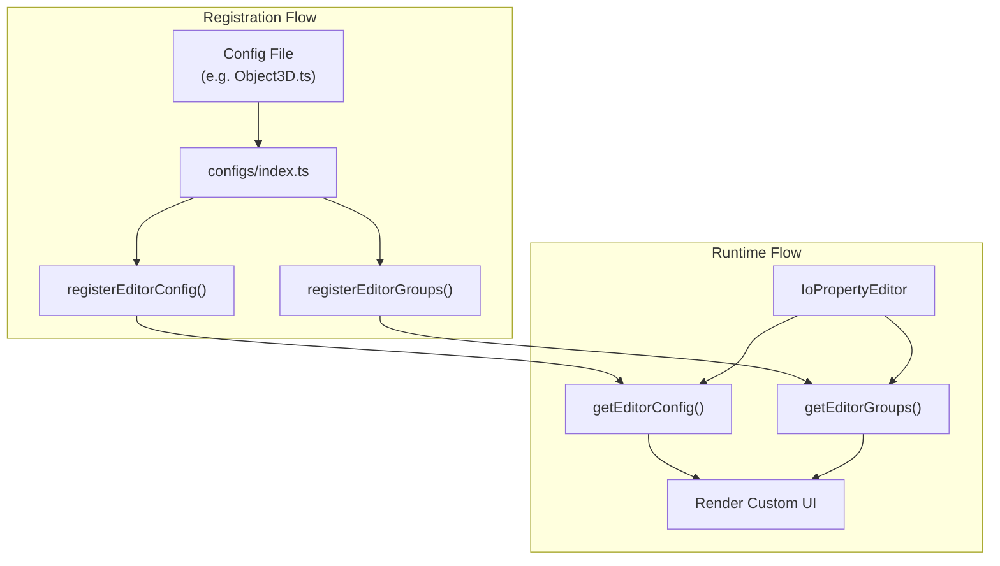

# Three.js UI Configurations Plan

## Overview

The configuration system enables customizing how three.js objects are displayed and edited in the io-gui inspector. Each three.js class can have:

1. **EditorConfig** - Maps specific properties to custom editor components
2. **EditorGroups** - Organizes properties into collapsible categories

## Architecture




## Config File Pattern

Each config file follows this structure:

```typescript
import { registerEditorConfig, registerEditorGroups, ioVector } from "@io-gui/editors"
import { ioNumberSlider } from "@io-gui/sliders"
import { ioOptionSelect, MenuOption } from "@io-gui/menus"
import { SomeClass } from "three/webgpu"

// 1. Register custom editors for specific properties
registerEditorConfig(SomeClass, [
  ['propertyName', ioNumberSlider({min: 0, max: 100, step: 1})],
  ['vectorProp', ioVector({min: -Infinity, max: Infinity, step: 0.1})],
  ['enumProp', ioOptionSelect({selectBy: 'value', option: new MenuOption({options: [
    {value: 0, id: 'Option1'},
    {value: 1, id: 'Option2'},
  ]})})],
])

// 2. Organize properties into groups
registerEditorGroups(SomeClass, {
  Main: ['primaryProp1', 'primaryProp2'],
  Transform: ['position', 'rotation', 'scale'],
  Advanced: ['internalProp'],
  Hidden: ['privateProp', /^_/],  // Can use RegExp
})
```


## Available Editor Components

| Component | Import From | Use Case ||-----------|-------------|----------|| `ioVector` | `@io-gui/editors` | Vector2/3/4, Euler, Quaternion || `ioMatrix` | `@io-gui/editors` | Matrix2/3/4 elements || `ioNumberSlider` | `@io-gui/sliders` | Bounded numeric values || `ioNumber` | `@io-gui/inputs` | Unbounded numeric values || `ioString` | `@io-gui/inputs` | Text properties || `ioSwitch` | `@io-gui/inputs` | Boolean toggles || `ioOptionSelect` | `@io-gui/menus` | Enum/constant selection || `ioColorRgba` | `@io-gui/colors` | Color properties || `ioField` | `@io-gui/inputs` | Read-only display |

## Directory Structure

Mirror three.js module organization in [`packages/three/src/configs/`](packages/three/src/configs/):

```javascript
configs/
├── index.ts              # Central registration (imports all configs)
├── constants.ts          # Reference for three.js constants
├── animation/
│   ├── AnimationAction.ts
│   ├── AnimationMixer.ts
│   └── AnimationClip.ts  # TODO
├── cameras/
│   ├── Camera.ts
│   ├── PerspectiveCamera.ts
│   └── OrthographicCamera.ts
├── core/
│   ├── Object3D.ts
│   └── BufferGeometry.ts
├── lights/
│   ├── Light.ts
│   ├── DirectionalLight.ts
│   ├── PointLight.ts
│   └── SpotLight.ts
├── materials/
│   └── Material.ts       # Base + specific materials
├── math/
│   ├── Matrix2.ts
│   ├── Matrix3.ts
│   └── Matrix4.ts
├── objects/
│   ├── Mesh.ts
│   └── Group.ts
├── scenes/
│   └── Scene.ts
└── textures/
    └── Texture.ts
```


## Implementation Steps

### 1. Create Config File

Create a new `.ts` file in the appropriate subdirectory matching three.js structure.

### 2. Import Dependencies

```typescript
import { registerEditorConfig, registerEditorGroups } from "@io-gui/editors"
import { TargetClass } from "three/webgpu"
```


### 3. Register in Index

Add import to [`packages/three/src/configs/index.ts`](packages/three/src/configs/index.ts):

```typescript
import './category/ClassName.js';  // Note: .js extension for ES modules
```


### 4. Define Configs

Study three.js class properties via TypeScript types or docs, then:

- Assign appropriate editor components to each property
- Group related properties logically
- Mark internal/private properties as Hidden or Advanced

## Key Examples

**[Object3D.ts](packages/three/src/configs/core/Object3D.ts) **- Base class with Transform/Rendering groups**[Scene.ts](packages/three/src/configs/scenes/Scene.ts) **- Uses `ioVector` for rotations, `ioNumberSlider` for intensities**[AnimationAction.ts](packages/three/src/configs/animation/AnimationAction.ts)** - Uses `ioOptionSelect` for enum constants

## Priority Classes to Configure

Based on common usage, suggested priority order:

1. **Cameras**: PerspectiveCamera, OrthographicCamera