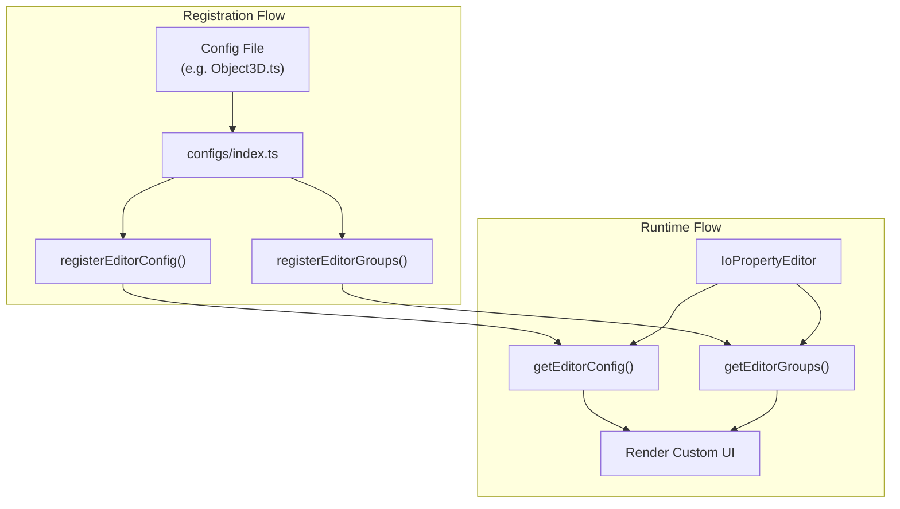

# Three.js UI Configurations Plan

## Overview

The configuration system enables customizing how three.js objects are displayed and edited in the io-gui inspector. Each three.js class can have:

1. **EditorConfig** - Maps specific properties to custom editor components
2. **EditorGroups** - Organizes properties into collapsible categories

## Architecture



## Two Config Patterns

### Pattern 1: Type-Based Config (Math Primitives)

For classes that are used as **property values** (Vector3, Color, Box3, etc.), register on `Object` with the class as the property identifier. This means "when any property has this type, use this editor."

```typescript
import { registerEditorConfig, ioVector } from "@io-gui/editors"
import { Vector3 } from "three/webgpu"

// Applies to ANY property of type Vector3 on ANY object
registerEditorConfig(Object, [
  [Vector3, ioVector({min: -Infinity, max: Infinity, step: 0.1})],
])
```

**Use for**: Vector2/3/4, Quaternion, Euler, Color, Matrix2/3/4, Box2/3, Sphere, Plane, Triangle, etc.

### Pattern 2: Class-Based Config (Inspectable Objects)

For classes that are **inspected directly** (Camera, Scene, Mesh, etc.), register on the class itself to define property editors and groups.

```typescript
import { registerEditorConfig, registerEditorGroups } from "@io-gui/editors"
import { ioNumberSlider } from "@io-gui/sliders"
import { PerspectiveCamera } from "three/webgpu"

// Property editors for this specific class
registerEditorConfig(PerspectiveCamera, [
  ['fov', ioNumberSlider({min: 1, max: 180, step: 1})],
  ['zoom', ioNumberSlider({min: 0.01, max: 10, step: 0.01, exponent: 3})],
])

// Property grouping for this class
registerEditorGroups(PerspectiveCamera, {
  Main: ['fov', 'aspect', 'near', 'far', 'zoom'],
  Film: ['focus', 'filmGauge', 'filmOffset'],
  Advanced: ['view'],
})
```

**Use for**: Camera, Scene, Object3D, Mesh, Light, AnimationMixer, etc.

## Special Cases

### Abstract Classes
For abstract classes, create a comment-only file pointing to concrete implementations:

```typescript
// Interpolant is an abstract class, so we register groups on concrete classes instead
// See ./interpolants/*.ts for concrete interpolant configs
```

### Utility Modules
For utility function collections, create a comment-only file explaining they're not configured:

```typescript
// MathUtils is a collection of utility functions, so we don't need to register it directly
```

## Available Editor Components

| Component | Import From | Use Case |
|-----------|-------------|----------|
| `ioVector` | `@io-gui/editors` | Vector2/3/4, Euler, Quaternion |
| `ioMatrix` | `@io-gui/editors` | Matrix2/3/4 elements |
| `ioPropertyEditor` | `@io-gui/editors` | Composite objects (Box3, Sphere, etc.) |
| `ioNumberSlider` | `@io-gui/sliders` | Bounded numeric values |
| `ioNumber` | `@io-gui/inputs` | Unbounded numeric values |
| `ioString` | `@io-gui/inputs` | Text properties |
| `ioSwitch` | `@io-gui/inputs` | Boolean toggles |
| `ioOptionSelect` | `@io-gui/menus` | Enum/constant selection |
| `ioColorRgba` | `@io-gui/colors` | Color properties |
| `ioField` | `@io-gui/inputs` | Read-only display |

## Default Editors (Don't Configure!)

The editor system has built-in defaults for primitive types defined in `@io-gui/editors` `EditorConfig.ts`:

| Type | Default Editor |
|------|----------------|
| `String` | `ioString()` |
| `Number` | `ioNumber({step: 0.01})` |
| `Boolean` | `ioSwitch()` |
| `Object` | `ioObject()` |
| `Function` | `ioButton()` |
| `null`/`undefined` | `ioField({disabled: true})` |

**IMPORTANT: Only configure properties that need different behavior!**

Examples of when to configure:
- Use `ioNumberSlider` instead of default `ioNumber` for bounded values (fov, zoom, intensity)
- Use `ioNumber({min: 0, max: Infinity, step: 1})` for integers or different step values
- Use `ioColorRgba` for Color properties
- Use `ioOptionSelect` for enum/constant selections
- Use `ioVector`, `ioMatrix`, `ioPropertyEditor` for composite types

Do NOT configure:
- Simple boolean properties (already use `ioSwitch()`)
- Simple string properties (already use `ioString()`)
- Generic number properties where default step is fine

## Index File Rules

In [`packages/three/src/configs/index.ts`](packages/three/src/configs/index.ts):

1. **Import order matters**: Classes must be imported in order of their inheritance (base classes first)
2. Use `.js` extension for ES module imports
3. Keep commented-out imports as reference for unconfigured classes

## Testing and Debugging

Use [`packages/three/src/demos/IoThreeDemo.ts`](packages/three/src/demos/IoThreeDemo.ts) to test and debug UI configurations in the browser.

The demo contains an `allClasses` object with instances of all configured three.js classes. These are rendered via `ioPropertyEditor` in the "AllClasses" tab, allowing you to visually inspect and interact with every configured UI.

**IMPORTANT: When adding new configs, always update `allClasses` in IoThreeDemo.ts!**

**To add a new class for testing:**

```typescript
const allClasses = {
  // ... existing classes ...
  myNewClass: new THREE.MyNewClass(),
}
```

**Run the demo:**
```bash
pnpm serve
# Navigate to the three demo page
```

This is essential for verifying that:
- Property editors render correctly
- Groups are organized logically
- Sliders have appropriate min/max/step values
- Option selects show all valid constants

## Workflow Checklist

When configuring a new module:

1. Create config files for each class in the module
2. Update `configs/index.ts` with imports (in inheritance order)
3. **Add instances to `allClasses` in `IoThreeDemo.ts`**
4. Update the Progress Tracker in this plan
5. Test in browser via `pnpm serve`

## Progress Tracker

### Completed

- [x] **math/** - All classes configured
  - Vectors: Vector2, Vector3, Vector4
  - Matrices: Matrix2, Matrix3, Matrix4
  - Rotations: Quaternion, Euler
  - Colors: Color, ColorManagement
  - Geometry: Box2, Box3, Sphere, Plane, Triangle, Line3, Ray
  - Coordinates: Spherical, Cylindrical
  - Advanced: Frustum, FrustumArray, SphericalHarmonics3
  - Interpolants: Interpolant (abstract), CubicInterpolant, LinearInterpolant, DiscreteInterpolant, QuaternionLinearInterpolant
  - Skipped: MathUtils (utility functions only)

- [x] **cameras/** - All classes configured
  - Camera, StereoCamera, PerspectiveCamera, OrthographicCamera, CubeCamera, ArrayCamera

- [x] **core/** - All classes configured
  - Base: Object3D, EventDispatcher
  - Time: Clock, Timer
  - Picking: Raycaster, Layers
  - Attributes: BufferAttribute, InstancedBufferAttribute, GLBufferAttribute
  - Interleaved: InterleavedBuffer, InstancedInterleavedBuffer, InterleavedBufferAttribute
  - Geometry: BufferGeometry, InstancedBufferGeometry
  - Uniforms: Uniform, UniformsGroup
  - Render Targets: RenderTarget, RenderTarget3D

- [x] **scenes/** - All classes configured
  - Scene, Fog, FogExp2

- [x] **animation/** - All classes configured
  - Core: AnimationMixer, AnimationAction, AnimationClip, AnimationObjectGroup
  - Keyframes: KeyframeTrack (base), BooleanKeyframeTrack, ColorKeyframeTrack, NumberKeyframeTrack, QuaternionKeyframeTrack, StringKeyframeTrack, VectorKeyframeTrack
  - Internal: PropertyBinding, PropertyMixer
  - Skipped: AnimationUtils (utility functions only)

- [x] **audio/** - All classes configured
  - AudioListener (extends Object3D)
  - Audio (extends Object3D) - global non-positional audio
  - PositionalAudio (extends Audio) - 3D spatialized audio with PannerNode
  - AudioAnalyser - standalone analyzer class
  - Skipped: AudioContext (namespace with utility functions)

### TODO

- [ ] **lights/** - DirectionalLight, PointLight, SpotLight, AmbientLight, HemisphereLight, RectAreaLight, Light, LightProbe
- [ ] **objects/** - Mesh, Group, SkinnedMesh, Skeleton, Bone, InstancedMesh, BatchedMesh, Line, LineSegments, LineLoop, Points, Sprite, LOD
- [ ] **materials/** - Material base class and all material types
- [ ] **textures/** - Texture base class and all texture types
- [ ] **geometries/** - All geometry types
- [ ] **helpers/** - All helper classes
- [ ] **loaders/** - All loader classes
- [ ] **renderers/** - WebGPURenderer, RenderTarget, etc.
- [ ] **extras/** - Curves, Shape, Path, Controls, etc.

## Key Examples

- **[Vector3.ts](packages/three/src/configs/math/Vector3.ts)** - Type-based config with `ioVector`
- **[Box3.ts](packages/three/src/configs/math/Box3.ts)** - Type-based config with `ioPropertyEditor`
- **[Color.ts](packages/three/src/configs/math/Color.ts)** - Type-based config with `ioColorRgba`
- **[PerspectiveCamera.ts](packages/three/src/configs/cameras/PerspectiveCamera.ts)** - Class-based config with sliders and groups
- **[CubicInterpolant.ts](packages/three/src/configs/math/interpolants/CubicInterpolant.ts)** - Groups-only config for concrete class
- **[AnimationAction.ts](packages/three/src/configs/animation/AnimationAction.ts)** - Uses `ioOptionSelect` for enum constants
- **[BufferAttribute.ts](packages/three/src/configs/core/BufferAttribute.ts)** - Uses `ioOptionSelect` for GPU usage/type constants
- **[BufferGeometry.ts](packages/three/src/configs/core/BufferGeometry.ts)** - Groups-only config for geometry properties
- **[Fog.ts](packages/three/src/configs/scenes/Fog.ts)** - Combined class-based and type-based config for inline editing